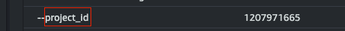
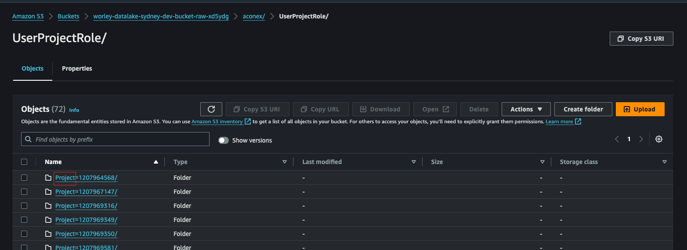

# Generic Curation Layer Job
The implementation of a Generic Curation Layer job enables the transition from traditional Data Lake to an advanced Data Lakehouse architecture.

At it's core the generic curation job moves data from the Raw Data Lake layer to Iceberg tables, a key component of the Data Lakehouse.

The key ways in which the Generic Curation Layer job enables this transition include:

1. Data Standardization and Governance : By applying schema definitions , the job ensures data consistency
2. Simplified Transformation Execution : The Generic Curation Layer job leverages the metadata to execute the necessary data transformations as the data is moved from the Data Lake to the Iceberg tables.
3. Flexible Loading Modes : The Generic Curation Layer job provides the capability to load data into the Iceberg tables using different modes (e.g., full load, incremental load etc) based on the characteristics of the source data.
4. Time Travel and Snapshotting : Iceberg tables, the target of the curation layer job, provide time travel capabilities & snapshotting features which enables efficient version control and data rollbacks
5. Unified Data Access : By moving data into Iceberg tables, the curation layer job enables an unified data access layer within the Data Platform
6. Interoperability : The Iceberg table format, which the curation layer job utilizes, ensures interoperability across different data processing frameworks and tools.

## Metadata Configuration
The Generic Curation Job leverages the helper library that provides a wrapper on top of common functionality to process data within the AWS Data Platform. It's main purpose is to read data from the `raw` layer and move it to the `curated` layer (i.e. Iceberg Table). This process is defined for each table to allow the Data Engineer to declaratively run the data pipelines.

The configuration file has the following goals:

1. Reuse logic across different data assets
2. Minimise the amount of code the data engineer needs to develop
3. Mantain governance by version controlling the file
4. Provide flexibility to cater for a wide spread of use cases.


  The file is composed of the following main sections:

  |  **Section** 	  |                        **Description**                        	|
|:------------:	    |:-------------------------------------------------------------:	|
| `source`     	    | Defines the location of the source data assets.               	|
| `transforms` 	    | Defines a list of transformation to be run against the source 	|
| `target`     	    | Defines the end location of the data asset.                   	|
| `table_schema`    | Define the expected schema of the data asset                  	|\

### Source
This section has various properties for reading data from Raw Layer (i.e. S3 Buckets) :

- name :  The name of the specific table within the broader data source landscape.
- compute_engine : The compute engine defines the underlying technology used for processing the data. Supported values are **spark**.
- spark_options : The format of the source data is crucial for determining the appropriate read and processing mechanisms.
  - format : The format of the source data is crucial for determining the appropriate read mechanism. Supported values are **parquet**
- glue_options : The various glue configurations needed while reading the data from the raw layer.
  - connection_type : The type of source within which files of the raw layer are present. Supported values are **s3**
  - connection_options : The connection options provide the necessary details for accessing the source data, such as the S3 bucket and prefix.
  - format : The format of the source data is crucial for determining the appropriate read mechanism. Supported values are **parquet**
  - format_options: This property corresponds to format_options parameter when creating a Glue DynamicFrame from a data source and it allows you to specify additional options. The significance and usage of format_options depend on the specific data format you're working <a href="https://docs.aws.amazon.com/glue/latest/dg/aws-glue-programming-etl-format.html">with</a>.
    - mergeSchema : Specifies whether to merge the schema of the data if the data files havedifferent but mutually compatible schemas. Supported values are **true** or **false**
  - transformation_ctx : The transformation context helps to track the specific processing steps applied to the data files, which is useful for maintaing the job bookmarks for tracking processed files.

### Transforms
This section has various properties that determines transformation to be run against the source:

- transform : rename_columns
    - rename_column : Renaming columns is  necessary to align the source data with the desired target schema and naming conventions. Supported values are **true** or **false**

- transform : select_columns_from_config_file
    - select_columns : Selecting specific columns from the source data based on a configuration specified within **columns** section to ensure the target schema includes only the necessary data. Supported values are **true** or **false**

- transform : change_data_types
    - change_types : Changing the data types of the source data for ensuring the data is stored and processed in the appropriate format as per the target table. Supported values are **true** or **false**

- transform : add_run_date
    - column_name : Adding a run date column is useful for tracking the processing timeline and  enabling time-based analysis or partitioning.
    - date_format :  The date format ensures the run date column is stored in the desired format.

- transform: custom_sql
    - sql: The custom SQL transformation allows for more complex data manipulations and enrichments, which can be crucial for processing the data for the target table.
    - temp_view_name : The temporary view name helps to manage the intermediate data processing steps.

    For example, the custom sql transformation can be leveraged to typecast a field with a specific date format (like "dd-MM-yy")
    with below SQL.

    ```SELECT datasource_num_id, br_key, gbs_key, from_currency, to_currency, conversion_type, conversion_rate, 'oracle_gbs' as SOURCE_SYSTEM_NAME, to_date(month_start_date, 'dd-MM-yy') AS month_start_date, to_date(month_end_date, 'dd-MM-yy') AS month_end_date FROM temp_df_static```
 
<div class="note">
  <strong>Note:</strong> If there are specfic transformations which are not needed for your table, you can skip corresponding section.
</div>

### Table Schema
This section has various properties for defining the expected schema of the table or data asset:

- schema_properties : The various porperties of the the table schema can be specifed here.
    - enforce : Enforcing the schema ensures the data written to the target table matches the expected structure. Supported values are **true** or **false**
    - primary_key: Defining the primary key column(s) based on which data would be handled in the target table. If there are multiple columns, specify a list of columns as per target table schema.
    - rename_columns: Significance: Renaming columns during the schema definition aligns the target table structure with the desired naming conventions. Supported values are **true** or **false**
- columns : The columns of the table are specified within the columns section.
    - column_name : The column name defines the specific attribute nameof the data being stored in the target table.
    - column_data_type : The data type of the column in the target table.
    - nullable : The nullable property specifies whether the column can contain null values. Supported values are **true** or **false**
    - comment : The column comment provides additional context and documentation about the attribute.
    - data_classification: The data classification helps to identify the sensitivity or confidentiality of the data.
    - raw_column_name : The raw column name within the raw data location.

<div class="note">
  <strong>Note:</strong> If no column renames and data type changes are needed from raw layer schema, you skip the columns section. <br>
  <strong>Note:</strong> In case, a specific column from the raw layer isn't present in the data but is present within column configuration, a corresponding curated column would be created for raw column and NULL values will be added
</div>

### Target
This section has various properties for the target table or the data asset:

- name : The name of the data asset that helps to identify the table within the broader source ecosystem.
- compute_engine: The compute engine defines the underlying technology used for writing the data to the target. Supported values are **spark**
- drop_duplicates : This property defines whether duplicate rows have to be dropped while writing to the target table. Even if one of the attrbiutes, have a different values within the record, it wouldn't be dropped. Supported values are **true** or **false**
- iceberg_properties : The various properties of the target iceberg table.
  - database_name :  The database name specifies the location where the Iceberg table will be created, which is important for organizing and managing the data within the broader data infrastructure.
  - table_name: The table name defines the specific Iceberg table that will be the target for the data.
  - iceberg_configuration : The various iceberg configurations.
    - create_table :  This property defines whether the Iceberg table can be created if it doesn't exist. Supported values are **true** or **false**
    - iceberg_catalog_warehouse : The Iceberg catalog warehouse location specifies where the Iceberg table metadata & data is stored,  which is important for enabling the table to be accessed and queried.
    - table_properties : The various configurations needed while creating the Iceberg Table.
      - write.format.default: The data format of the files in the storage location. Supported values are **parquet**
      - format-version : The format version specifies the version of the Iceberg table format. The latest version is **2**
- cdc_properties : The various configurations which need to be specified when the load type is **cdc**. For other load types, this section can be skipped.
  - cdc_operation_column_name : The column name within the incoming data from raw layer which consist of the operation performed.
  - cdc_operation_value_map : The value indicatorvfor different types of operations performed. 
    - insert : The value of the cdc_operation_column_name for the new inserted rows.
    - update : The value of the cdc_operation_column_name for the updated rows.
    - delete : The value of the cdc_operation_column_name for deleted rows.
  
    **Please note that the value specifed for each operation is case sensitive**. 

- primary_constraint_properties : The various configurations which need to be specified to enforce deduplication on the primary key attribute.
    - enforce_primary_constraint : This property defines whether the primary attribute deduplication needs to be enforced or not. Supported values are **true** or **false**
    - timestamp_column_name : The name of the timestamp column based on which the latest record would be selected.

#### Load Type

load_type : The load type specifies the data loading strategy into the target Iceberg Table. The following load_types are supported:
  
  - full_load : Truncate the data in target table and re-load with incoming data from raw layer

  - incremental : 

    - This load type is to be used when  the incoming data from raw layer is a point in time full refresh i.e. it consists of unchanged records, records which added or updated. Data is loaded to target table in **SCD Type 2** manner. 
    - Records which exist in the target table and aren't present in incoming data are considered as deleted records and will be soft deleted in the target table. 
    - This load type leverages the primary key to identify new version and old version of the record. If a primary key is not present, a row hash is used as the primary key. 
    - The SCD Type 2 behaviour may not be consistent if row hash is used as primary key.

  - cdc :

    - This load type is to be used when  the incoming data from raw layer consists of **changes** which happened from the previous run. 
    - A status column defined (within the cdc_properties) indicates the type of operation i.e. insert, update or delete.
    - Data is loaded to target table in **SCD Type 2** manner. 
    - The CDC load type uses the **cdc_properties** section and **primary_key** section. Data load would fail if either of these are not specified.
  
  - incremental_no_delete :

    - This load type is to be used when  the incoming data from raw layer consists of changed or updated. Data is loaded to target table in **SCD Type 2** manner. 
    - This load type leverages the primary key to identify new version and old version of the record.
    - This load type would not need a status column to derive the nature of change
    - This load type would not account for records deleted in the source system. 
  
  - append : Append the incoming data from raw layer to target table.

#### Entity Level Load
Entity Level load enables data load into Iceberg tables at the particular attribute or entity level like Project, SecOrg etc, offering more granular control and flexibility.

- entity_load : The entity_load configuration indicates whether entity load has to enabled or not. Supported values are **true** or **false**

- entity_load_properties : The below properties need to be defined for a partciular entity or attribute.
    
    - entity_table_attribute_name : The name of the **Iceberg Curateed Table Attribute** based on which data should be loaded
    - entity_job_attribute_name : The name of the job argument which has the value of the above mentioned attribute.
        
          

    - entity_s3_raw_partition_prefix : The S3 Partition Prefix within Raw S3 Bucket within the dataset which indicates the partition (without the '=').

          

> NOTE:

> In case, there are multiple entities based on which data has to be loaded, a list of entity properties has to be provided in the metadata. Further, please ensure the order of the entities is same as the hierarchy followed within S3 Raw Bucket.

> All the properties within Entity Load Properties are case sensitive.

    
## Roadmap
- Data Quality Rules Integration :  Enabling users to define and apply data quality rules directly within the curation layer job, strengthening the overall data quality and reliability.
- Automated Schema Evolution :  Streamlining the process of schema changes, such as adding, dropping, or renaming columns, to reduce the manual effort required and ensure seamless data evolution.
- Iceberg Table Maintenance Operations : Integrating capabilities to perform maintenance tasks on Iceberg tables, such as expiration, and optimization, to ensure the efficient and sustainable management of the Data Lakehouse.

## Example Configuration File

    ```
    # Sample YAML to showcase reading from parquet files and writing to Iceberg
    # Define Data Source
    source:
      name: activitycode
      compute_engine: spark
      spark_options:
        format: parquet
      glue_options:
        connection_type: "s3"
        connection_options: "s3://<data_location>/{source_system_id}/{input_file}/"
        format: "parquet"
        format_options:
          mergeSchema: "true/false"
        transformation_ctx: "{source_system_id}-{input_file}"

    # Define standard transformations
    transforms:
      - transform: custom_sql
        temp_view_name: my_table
        sql: "select * from my_table"
      - transform: add_run_date
        column_name: execution_date
        date_format: yyyy-MM-dd
    # Define Target
    target:
      name: <sample_name>
      compute_engine: spark
      iceberg_properties:
        database_name: <curated_glue_database>
        table_name: <curated_glue_database_table>
        iceberg_configuration:
          create_table: true
          iceberg_catalog_warehouse: <curated_data_location>/{source_system_id}/{input_file.lower()}/
          table_properties:
            write.format.default: parquet
            format-version: "2"
      spark_options:
        format: iceberg
        options:
          path: "s3://<curated_data_location>/{source_system_id}/{input_file}"
    ```
ss
## Example Target Section for different Load scenarios

- Delete the existing data in target table and load the incoming records

  ```
    target:
  compute_engine: spark
  iceberg_properties:
    database_name: worley_datalake_sydney_dev_glue_catalog_database_spel
    iceberg_configuration:
      create_table: true
      iceberg_catalog_warehouse: worley-datalake-sydney-dev-bucket-curated-xd5ydg/spel/T_Cable/
      table_properties:
        format-version: '2'
        write.format.default: parquet
    table_name: curated_t_cable
  load_type: full_load
  name: curated_t_cable
  spark_options:
    format: iceberg
    options:
      path: s3://worley-datalake-sydney-dev-bucket-curated-xd5ydg/spel/curated_t_cable
  ```

- Append records in incoming dataset to the target table

  ```
    target:
  compute_engine: spark
  iceberg_properties:
    database_name: worley_datalake_sydney_dev_glue_catalog_database_spel
    iceberg_configuration:
      create_table: true
      iceberg_catalog_warehouse: worley-datalake-sydney-dev-bucket-curated-xd5ydg/spel/T_Cable/
      table_properties:
        format-version: '2'
        write.format.default: parquet
    table_name: curated_t_cable
  load_type: append
  name: curated_t_cable
  spark_options:
    format: iceberg
    options:
      path: s3://worley-datalake-sydney-dev-bucket-curated-xd5ydg/spel/curated_t_cable
  ```

- **CDC based load** into target table (SCD Type 2) driven by a CDC Staus column indicating the type of operation

  ```
  target:
  cdc_properties:
    cdc_operation_column_name: status
    cdc_operation_value_map:
      delete: D
      insert: M
      update: M
  compute_engine: spark
  iceberg_properties:
    database_name: worley_datalake_sydney_dev_glue_catalog_database_erm
    iceberg_configuration:
      create_table: true
      iceberg_catalog_warehouse: worley-datalake-sydney-dev-bucket-curated-xd5ydg/erm/PublishPLItem/
      table_properties:
        format-version: '2'
        write.format.default: parquet
    table_name: curated_erm_publishplitem
  load_type: cdc
  name: curated_erm_publishplitem
  primary_key: primarykey
  spark_options:
    format: iceberg
    options:
      path: s3://worley-datalake-sydney-dev-bucket-curated-xd5ydg/erm/PublishPLItem
  ```

- Upsert (Update & Insert) load of the incoming records into target table (SCD Type 2) where **source pushes only updated and new records**. The below example shows the usage of drop_duplicates parameter for dropping exact duplicate records within the incoming records

  ```  
  target:
    name: curated_aconex_workflow
    compute_engine: spark
    drop_duplicates: true
    iceberg_properties:
      database_name: worley_datalake_sydney_dev_glue_catalog_database_aconex
      table_name: curated_workflow
      iceberg_configuration:
        create_table: true
        iceberg_catalog_warehouse: worley-datalake-sydney-dev-bucket-curated-xd5ydg/aconex/workflow/
        table_properties:
          write.format.default: parquet
          format-version: '2'
    load_type: incremental_no_delete
    primary_key: [WorkflowId,projectid,Assignee_UserId]
    spark_options:
      format: iceberg
      options:
        path: s3://worley-datalake-sydney-dev-bucket-curated-xd5ydg/aconex/workflow
  ```

- Performing a full refresh load into target table (SCD TYpe 2) with the incoming records where **source pushes the complete data**. The below example shows the usage of enforcing primary constraint property to ensure only the latest record (based on timestamp column) is considered if there are duplicates on primary key attributes

  ```
  target:
    compute_engine: spark
    load_type: incremental_no_delete
    name: curated_ecosys_project_list_bkp_merge
    primary_constraint_properties:
      enforce_primary_constraint: true
      timestamp_column_name: SystemDate
    iceberg_properties:
      database_name: worley_datalake_sydney_dev_glue_catalog_database_ecosys
      iceberg_configuration:
        create_table: true
        iceberg_catalog_warehouse: >-
          worley-datalake-sydney-dev-bucket-curated-xd5ydg/ecosys/project_list_bkp_merge/
        table_properties:
          format-version: '2'
          write.format.default: parquet
      table_name: curated_project_list_bkp_merge
    spark_options:
      format: iceberg
      options:
        path: >-
          s3://worley-datalake-sydney-dev-bucket-curated-xd5ydg/ecosys/project_list_bkp_merge
  ```

- **Deleting a subset of data based on the entity and loading the latest data for that particular entity.** The below example shows the usage of entity load properties.

  ```
  target: 
    compute_engine: "spark"
    drop_duplicates: "true"
    load_type: "full_load"
    entity_load: "true"
    entity_load_properties: 
      entity_job_attribute_name: "project_id"
      entity_s3_raw_partition_prefix: "Project"
      entity_table_attribute_name: "projectid"
    iceberg_properties: 
      database_name: "worley_datalake_sydney_dev_glue_catalog_database_aconex"
      iceberg_configuration: 
        create_table: "true"
        iceberg_catalog_warehouse: "worley-datalake-sydney-dev-bucket-curated-xd5ydg/aconex/userprojectrole/"
        table_properties: 
          format-version: "2"
          write.format.default: "parquet"
      table_name: "curated_userprojectrole"
  ```

## Troubleshooting

### Steps to be followed when Schema Changes are detected in the Raw Layer :
1. If there is a scenario where in the Sourcing DAG fails at the schema detection step, it would be because of the raw table schema changes like addtion of new columns, changes in column data types etc.

2. In such a scenario, the first step would be to refer the SNS Email Notification sent. The Email notification would consist of the table schema changes.

3. Based on the changes mentioned in the email Follow these steps to update the metadata:
    3 (a). Connect with Production Support/Admin Support as needed for this Step. Navigate to corresponding table in raw database in glue data catalog -> click on *Edit Schema as JSON* -> add the flagged columns to JSON Schema -> click on *Save as new table version*.
    3 (b). The curation metadata (or the contract) for the table should be updated in the columns section (present within table_schema section).

4. Once the curation metadata & raw table schema in data catalog is updated, reach out to production support or in case you have access, log into EMR Studio and open Athena Query Editor. Within the Athena Query Editor, execute the ALTER TABLE command to add the new columns or change the data types. For more information, please refer to this [documentation](https://docs.aws.amazon.com/athena/latest/ug/querying-iceberg-alter-table-add-columns.html).

Below is the example for one of the ALTER TABLE Command.

```
ALTER TABLE worley_datalake_sydney_dev_glue_catalog_database_construction_o3_curated.curated_constraints ADD columns
    (
        cwa string,
        cwastatusid string,
        cwastatus string,
        cwadescription string,
        cwalongdescription string,
        cwaexternallink string,
        cwarevision string,
        cwaestimatedhours string,
        plannedreleasedate string,
        forecastreleasedat string,
        cwaareareleaseid string,
        cwaarearelease string
    )
```