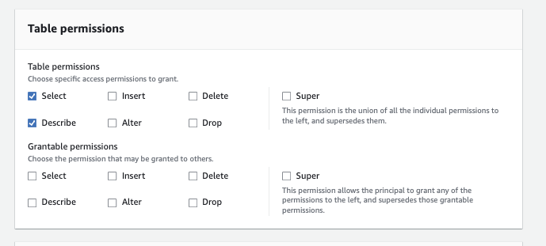
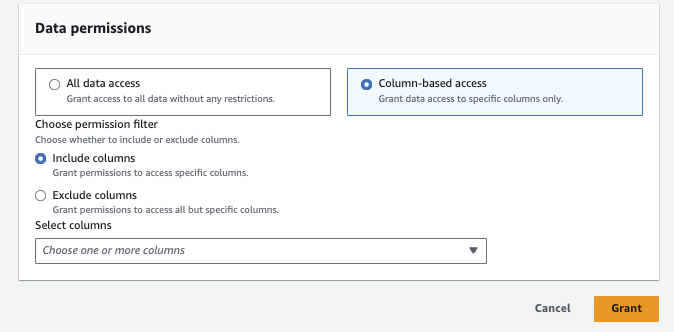
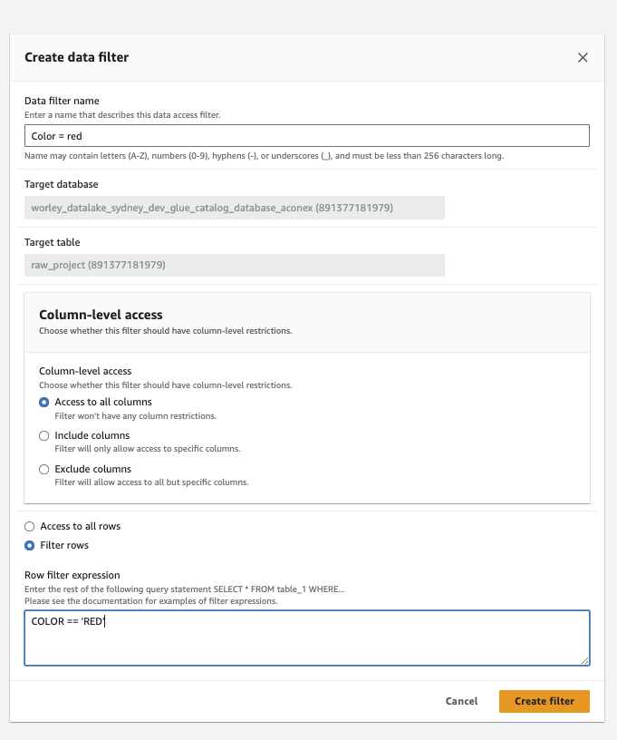

# Adding Lakeformation admins

* Account admin roles can set lakeformation admins in the lakeformation console
* Goto Administrative roles and tasks
* Click on add on the data lake administrator tab and select the role you want to grant admin access


# Granting database access
1. Select the database you want to grant access to 
2.  Click on action and then click grant
3. On the grant screen select IAM Identity Center and select the IDC group you want to gran access 
4.  On LF-Tags or catalog resources aread select `Named Data Catalog Resources`
5. The data base will be already selected for you, if you want to add more dbs feel free to do so.
6. Grant Describe permissions as below screen shot 

7. Click the Grant button


# Grant Table access 
1. follow steps 1 to 5 from the above section
2. Select the tables you want to grant access to from the tables drop down 

3. Grant select and describe permissions as below 

4. Click the Grant button

Note:

- If you need to use Lake Formation to control access:

Grant "Select" and "Describe" permissions to the tables to the redshift role (the role that is associated to the cluster & used to create the external schema) in Lake Formation.

For example, if you run the following to create the external schema:
```
create external schema if not exists cindy_test_ecosys_new_role from DATA CATALOG database 'worley_datalake_sydney_dev_glue_catalog_database_ecosys' catalog_id '891377181979' 
IAM_ROLE 'arn:aws:iam::891377181979:role/worley-datalake-sydney-dev-iam-service-role-redshift-awsidc'
```
In the above example, you will need to grant the role "worley-datalake-sydney-dev-iam-service-role-redshift-awsidc" permissions to access the tables in external schema.


- If you do not want to use Lake Formation to control access:

You can grant full permissions to the "IAMAllowedPrincipals" to access the tables. This means permissions are governed by the IAM role that runs the query, i.e. the redshift role ("worley-datalake-sydney-dev-iam-service-role-redshift-awsidc" in the above example). If this IAM role has permission to access that table, then it will be able to run queries against that table, so Lake Formation will no longer govern access to that table.

If you encounter any issue with granting permission to "IAMAllowedPrincipals" in the console, you can run the following CLI command, replace "database_name" and "table_name" with the actual values:
```
aws lakeformation grant-permissions --principal DataLakePrincipalIdentifier=IAM_ALLOWED_PRINCIPALS --permissions "ALL" --resource '{ "Table": {"DatabaseName":"database_name", "Name":"table_name"}}'
```


- If neither "IAMAllowedPrincipal" nor the redshift role is granted permissions in Lake Formation:

It will not have access at all. When you run queries against that table in Redshift Query Editor v2, it will error out with "AccessDeniedException from glue - Insufficient Lake Formation permission(s) on xxx".


# Column based Access 
1. Follow 1-3 from the above section and click on `column-based access` on the data permissions section 

2. Select the columns you want to include or exclude from the selected tables

# RLS using data filters
1. Follow steps 1-3 on Grant Table access section
2. click on create new under the data filters section 
3. Below is an example on how to create a data filter 
4. 