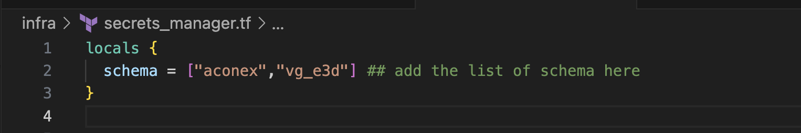
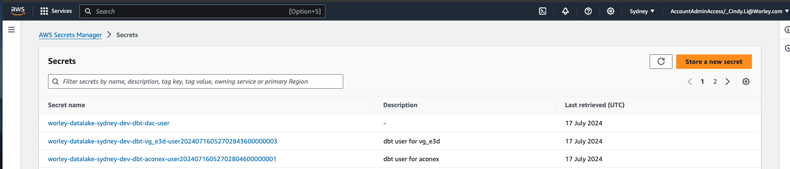
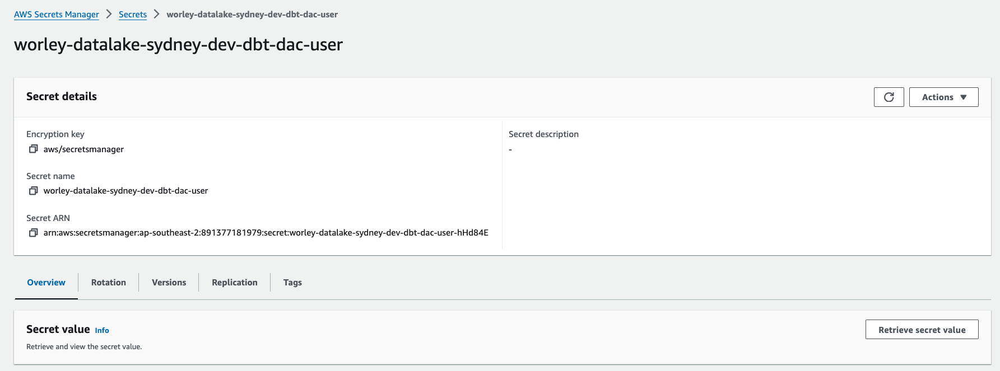

# Redshift Database Admin Set Up for DBT Data Modellers
This file documents the steps the Redshift Database Admin needs to perform to enable data modellers to create models and load them into Redshift.

There are two components the Database Admin needs to set up in AWS console - creating schemas and granting permissions in Redshift Query v2 and storing user credentials in Secrets Manager. 

## Redshift Query Editor v2
1. Log onto AWS access portal in the dev environment https://d-9767447864.awsapps.com/start/#/?tab=accounts
2. Select `RedshiftDBAdminAccess`
3. Type Redshift on the search bar and go to the Redshift 
4. Click on Query Editor v2 from the side menu
see screenshot:
 
5. Connect as an admin user

See gif how to switch to super user


6. Create a user for each schema using the follow command. For <user_name>, follow the naming convention of "dbt_<schema_name>_user". For example, we want to create a user named "dbt_dac_user" for the "dac" schema.
```
CREATE USER <user_name> PASSWORD 'sha256|<user_password>';
```
Make a note of the username and password. We will need to store them in Secrets Manager in the next section.

7. Create an external schema for the source aligned tables, this is where the data modellers will source the tables and build models on
```
create external schema if not exists <schema_name> from DATA CATALOG database <federated_database_name> catalog_id <account_id> 
IAM_ROLE <role_arn>
```
For example,
```
create external schema if not exists source_dac from DATA CATALOG database 'worley_datalake_sydney_dev_glue_catalog_database_dac' catalog_id '891377181979' 
IAM_ROLE 'arn:aws:iam::891377181979:role/worley-datalake-sydney-dev-iam-service-role-redshift-awsidc’
```
8. Create a target schema, this is where the data modellers will store the models
```
create schema <schema_name>
```
For example,
```
create schema "target_dac"
```
9. Grant permissions on the external schema and target schema to the user
```
GRANT USAGE on schema <external_schema_name> to <user_name>;
GRANT USAGE on schema <target_schema_name> to <user_name>;
GRANT CREATE ON SCHEMA <target_schema_name> TO <user_name>
```
For example,
```
GRANT USAGE on schema source_dac to dbt_dac_user;
GRANT USAGE on schema target_dac to dbt_dac_user;
GRANT CREATE ON SCHEMA target_dac TO dbt_dac_user
```

## Deploy Secrets Manager
1. Cut a feature branch
2. Navigate to infra/secrets_manager.tf
2. On line 2 of the secrets_manager.tf, add in the schema name, e.g. "vg_e3d". This will create secret to store the Redshift dbt user credentials
 
3. Create a Pull Request to merge this feature branch into main

## Update Secrets Manager
Once the secret from the last section is deployed:
1. Navigate to Secrets Manager in AWS Console
2. Click on the secrets tab
 
3. Search the schema name e.g. dbt_aconex and click on the secret
4. Click on the retrieve secret value and click edit to update the secret
 
5. Click on save to update the secret 

## Provide Information to Data Modellers
Once you have finished the set up, you need to provide the following information to the data modellers:
1. External schema name (from step 7 in "Redshift Query Editor v2" section)
2. Target schema name (from step 8 in "Redshift Query Editor v2" section)
3. Name of the secret from Secrets Manager (from "Update Secrets Manager" section)