# Redshift + QuickSight + Identity Center Integration Set Up
This file documents the steps required to set up Redshift + QuickSight + Identity Center integration. 

## Redshift
After the deployment of the redshift stack (infra/redshift.tf), perform the following steps:

### Enable Redshift Query Editor v2 for the Redshift IAM Identity Center 
1. On the Redshift console, choose <strong> IAM Identity Center connections </strong> in the navigation pane.
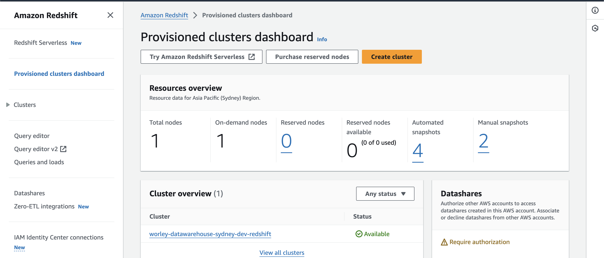
2. Choose the application.
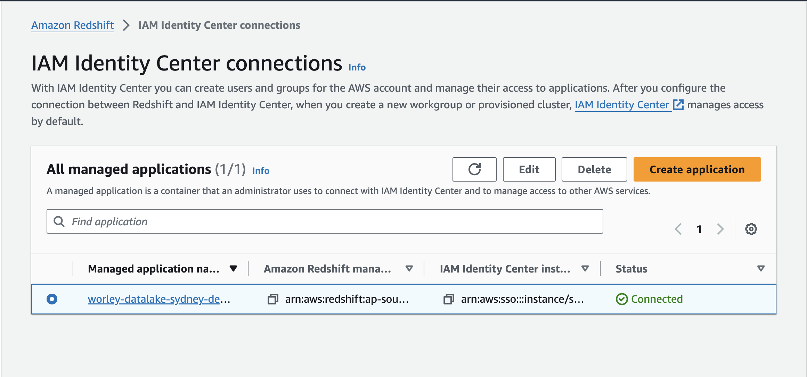
3. Choose <strong> Edit </strong>.
4. Select <strong> Enable Query Editor v2 application </strong> and choose <strong> Save changes </strong>.
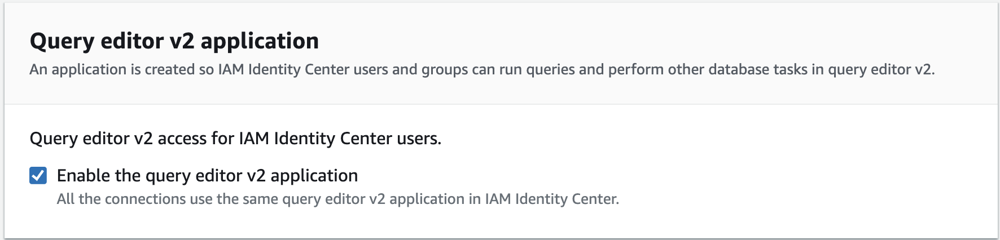
5. On the <strong> Groups </strong> tab, choose <strong> Add or assign groups </strong>.
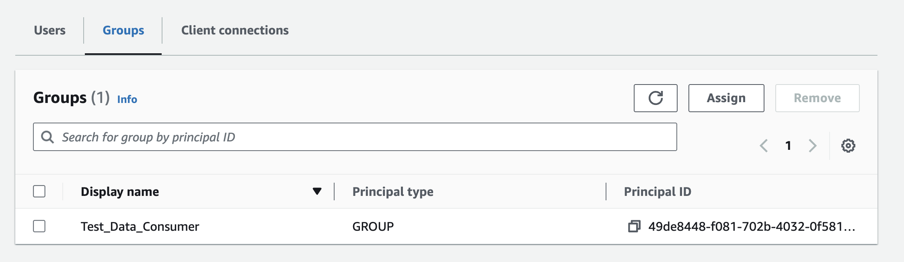
6. Assign groups from Identity Center that require access to the application.
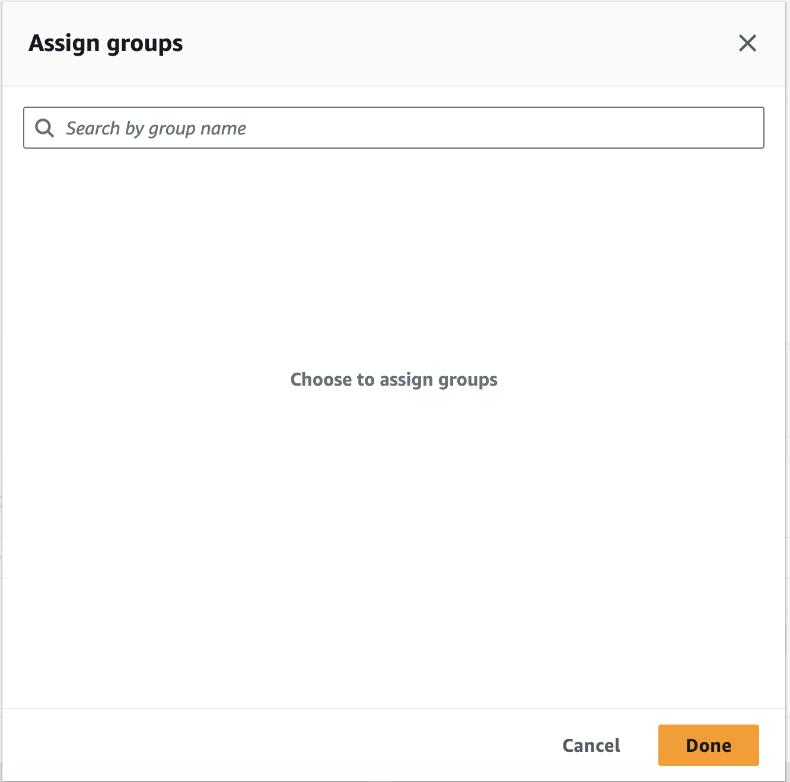

### Create an IdP for the Redshift IAM Identity Center Application
First, check if there is already an IdP for the Redshift IAM Identity Center Application, run the following command in Query Editor v2 as a database admin user:
```
SELECT * from svv_identity_providers;
```
If it exists, skip this section and move onto the next "QuickSight" section.

If it returns no results, run the following command to create an IdP for the Redshift IAM Identity Center Application with the database admin user:
```
CREATE IDENTITY PROVIDER <identity_provider_name> TYPE AWSIDC
NAMESPACE <namespace_name>
APPLICATION_ARN <arn>
IAM_ROLE <role>;
```
Go to the Redshift IAM Identity Center application (see step 1 and 2 from last section), note down the following items:

1. Identity provider namespace (for namespace_name in the above command)
2. IAM Identity Center managed application ARN (for arn in the above command)
3. IAM role for IAM Identity Center access (for role in the above command)

For <identity_provider_name>, give this new identity provider a name.

For example, it will look like this:
```
CREATE IDENTITY PROVIDER "worley-datalake-sydney-dev-redshift-idc-app" TYPE AWSIDC
NAMESPACE 'AWSIDC' APPLICATION_ARN 'arn:aws:sso::637423194134:application/ssoins-82599c89c0dd6c44/apl-e4d576f2e1c088f1'
IAM_ROLE 'arn:aws:iam::891377181979:role/worley-datalake-sydney-dev-iam-service-role-redshift-awsidc'
```

To verify it is created, you can run the following command:
```
SELECT * from svv_identity_providers;
```

## QuickSight
### Configure QuickSight Access to Redshift
At the QuickSight account set up stage, there needs to be at least one Identity Center group assigned to the QuickSight Admin Group. Anyone from the group is an admin user, who can modify the QuickSight groups.

In the dev account, we have assigned "Test_Data_Consumer" group as the QuickSight Admin Group at the account set up stage. Check with your active directory administrator to verify if you are part of the "Test_Data_Consumer" group in the dev environment. If yes, you are an admin user in the dev account.

1. Log into QuickSight as an admin user (i.e. a user that belongs in the QuickSight Admin Group). For access to QuickSight in dev account, navigate to this [link](https://d-9767447864.awsapps.com/start) and sign in with your sso credentials. Navigate to the "Applications" tab. For accessing QuickSight in the dev account, click on "WorleyAnalyticsDev".
2. Click on the top right human icon and select <strong> Manage QuickSight </strong>.
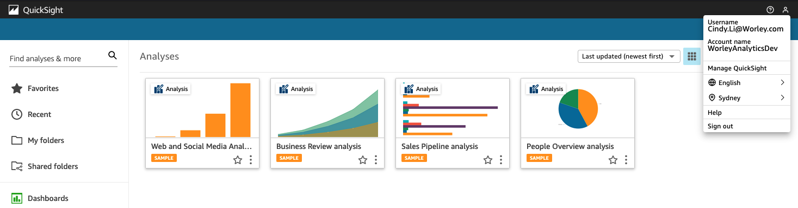
3. Select <strong> Security & permissions </strong>  in the navigation pane.
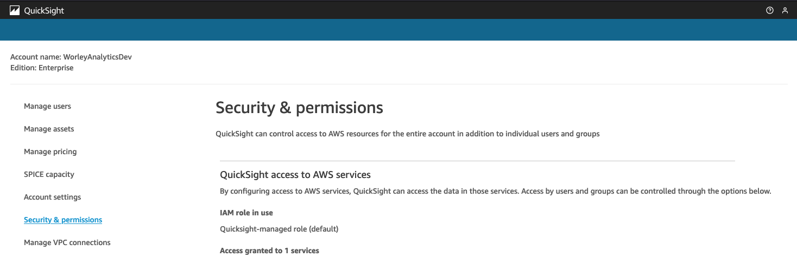
4. Under "QuickSight access to AWS services", select <strong> Manage </strong>.
5. Under "Allow access and autodiscovery for these resources", select <strong> Amazon Redshift </strong>, then <strong> Save </strong>.
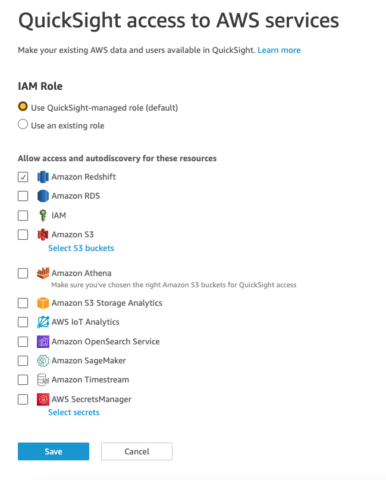

### Add QuickSight Groups
At the QuickSight account set up stage, there needs to be at least one Identity Center group assigned to the QuickSight Admin Group. Anyone from the group is an admin user, who can modify the QuickSight groups.

In the dev account, we have assigned "Test_Data_Consumer" group as the QuickSight Admin Group at the account set up stage. Check with your active directory administrator to verify if you are part of the "Test_Data_Consumer" group in the dev environment. If yes, you are an admin user in the dev account.

An admin user can assign groups from Identity Center to different QuickSight groups.

Here is a summary of the different QuickSight groups:
- <strong> ADMIN </strong> - The user is able to both use Amazon QuickSight for authoring and for performing administrative tasks like managing users or purchasing SPICE capacity.

- <strong> ADMIN PRO </strong> – The user is able to perform all actions of a QuickSight Admin and utilize applicable QuickSight Generative BI capabilities. 

- <strong> AUTHOR </strong> - The user is able to author analyses and dashboards in Amazon QuickSight but not perform any administrative tasks in QuickSight.

- <strong> AUTHOR PRO </strong> – The user is able to perform all actions of a QuickSight Author and utilize applicable QuickSight Generative BI capabilities. 

- <strong> READER </strong> – Users are able to interact with shared dashboards, but not author analyses or dashboards or perform any administrative tasks.

- <strong> READER PRO </strong> – The user is able to perform all actions of a QuickSight Reader and utilize applicable QuickSight Generative BI capabilities. 

If you need to assign/modify groups from Identity Center to these QuickSight groups, follow these steps:

1. Log into QuickSight as an admin user (i.e. a user that belongs in the QuickSight Admin Group). For access to QuickSight in dev account, navigate to this [link](https://d-9767447864.awsapps.com/start) and sign in with your sso credentials. Navigate to the "Applications" tab. For accessing QuickSight in the dev account, click on "WorleyAnalyticsDev".
2. Click on the top right human icon and select <strong> Manage QuickSight </strong>.
3. Select <strong> Manage users </strong> in the navigation pane.
4. Click on <strong> Manage role groups </strong>.
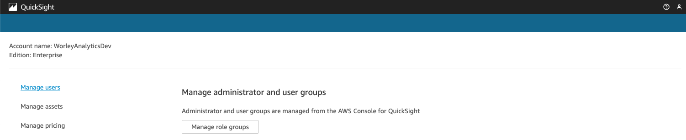
5. Click on <strong> Add groups </strong>.
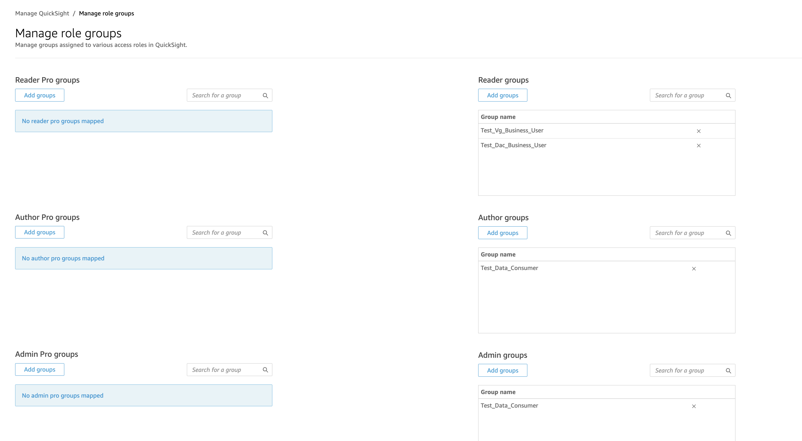
6. Search for the group from Identity Center and select <strong> Add selected groups </strong>.
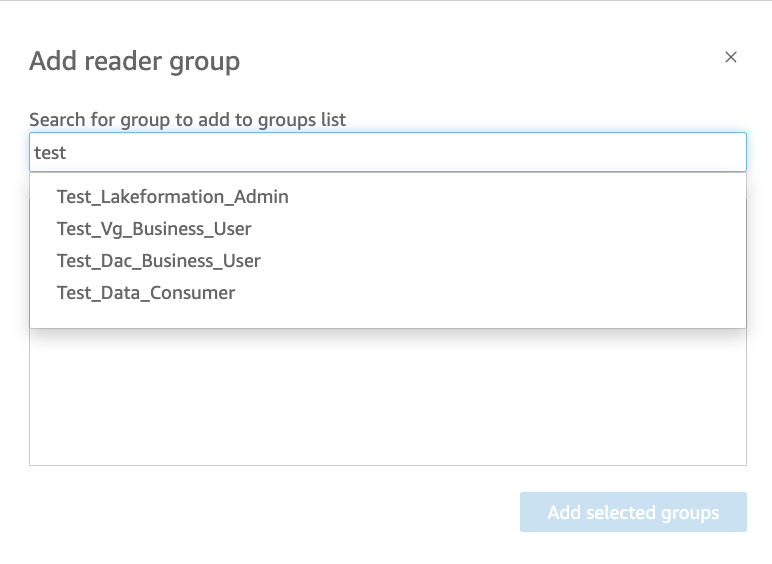