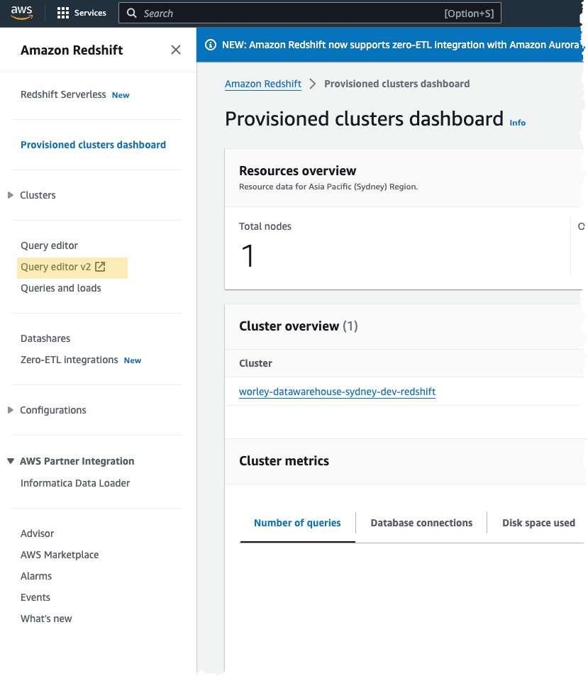

# Redshift DB Admin playbook
This document outlines useful redshift admin tasks, that could be use to grant access to data users (i.e. data engineer)  


# Accessing the platform

1. Log onto to AWS access portal in the dev environment https://d-9767447864.awsapps.com/start/#/?tab=accounts
2. Select `RedshiftDBAdminAccess`
3. Type redshift on the search bar and go to the redshift 
4. Click on Query Editor v2 from the side menu
see screenshot:
 


# Switching Identity types in Redshift Query Editor
Certain database administration activities requires switching to different identity types e.g. Granting permissions is a super user task. this section describes how to switch identity types in redshift query editor

### Super user
See gif how to switch to super user


## IAM Identity
See gif how to switch to IAM Identity 


# Redshift Internal Table Permission Grants
This section documents the process to apply Row Level Security (RLS), Column Level Security (CLS) and Dynamic Data Masking (DDM) policies to roles in Redshift that are mapped to Identity Center groups.

These are the 4 different use cases shown as part of the Proof of Concept demo:
1. dac-group: only has permissions to see the dac schema and the table within dac schema
2. data-consumer-group: has permissions to see both dac and vg schemas and their tables
3. dac-rl-group: has RLS and CLS applied on the dac users
4. dac-ddm-group: has RLS, CLS and DDM applied on the dac users

## Use Case 1: dac-group
This group only has permissions to see dac schema and the table within dac schema.

<strong> 1. Create a database role </strong>
```
CREATE ROLE <idcnamespace:rolename>;
```
The namespace and role name are the following:
- <em> IAM Identity Center namespace prefix </em> - This is the namespace you defined when you set up the connection between IAM Identity Center and Redshift

- <em> Role name </em> - This Redshift database role must match the group name in IAM Identity Center

Redshift connects with IAM Identity Center and fetches the information needed to create and map the database role to the IAM Identity Center group.

<ins> Note: </ins>

To check what “IAM Identity Center namespace prefix” is, you can run this command:
```
SELECT * from svv_identity_providers;
```
The prefix is shown in the “namespc” column of the query result.

<strong> 2. Grant permissions to schema and table </strong>
```
GRANT usage on schema <schemaname> to role <idcnamespace:rolename>;
GRANT select on table <tablename> to role <idcnamespace:rolename>;
```

Here is the complete SQL script for dac-group use case: 
```
create role “AWSIDC:dac-group”;
grant usage on schema dac to role “AWSIDC:dac-group”;
grant SELECT on TABLE dac.p6_activity to role “AWSIDC:dac-group”
```

## Use Case 2: data-consumer-group 
This group has permissions to see both dac and vg schemas and their tables.

Follow step 1 and 2 from the above “Use Case 1: dac-group” section to create a role and grant permissions to schemas and tables.

Here is the complete SQL script for data-consumer-group use case: 
```
create role “AWSIDC:data-consumer-group”;
grant usage on schema dac to role “AWSIDC:data-consumer-group”;
grant SELECT on TABLE dac.p6_activity to role “AWSIDC:data-consumer-group”
grant usage on schema vg to role “AWSIDC:data-consumer-group”;
grant SELECT on TABLE vg.p6_activity to role “AWSIDC:data-consumer-group”
```

## Use Case 3: dac-rl-group 
This group has RLS and CLS applied on the dac users.

<strong> 1. Create a database role </strong> (see step 1 from the above “Use Case 1:  dac-group” section)

<strong> 2. Grant permissions to the schema </strong>
```
GRANT usage on schema <schemaname> to role <idcnamespace:rolename>;
```

<strong> 3. Grant column level permissions </strong>
```
GRANT SELECT (columnname_1, columnname_2, columnname_3) on <schemaname>.<tablename> to role <idcnamespace:rolename>
```

<strong> 4. Create row level security policy </strong>
```
CREATE RLS POLICY <policy_name>
[ WITH (column_name data_type [, ...]) [ [AS] relation_alias ] ]
USING ( using_predicate_exp )
```
The parameters in the above command are:
- <em> policy_name </em> - the name of the policy

- <em> WITH (column_name data_type [, ...]) </em> - specifies the column_name and data_type referenced to the columns of tables to which the policy is attached. You can omit the WITH clause only when the RLS policy doesn’t reference any columns of the tables to which the policy is attached

- AS <em> relation_alias </em> - specifies an optional alias for the table that the RLS policy will be attached to

- USING <em> (using_predicate_exp) </em> - specifies a filter that is applied to the WHERE clause of the query. Amazon Redshift applies a policy predicate before the query-level user predicates. For example, current_user = ‘joe’ and price > 10 limits Joe to see only records with the price greater than $10

You can find more details on [RLS policy documenation](https://docs.aws.amazon.com/redshift/latest/dg/r_CREATE_RLS_POLICY.html)

<ins> Note: </ins>

If you want to create a look up table that defines what user can access what resources, here is an example to create a dynamic RLS policy:

```
-- create dynamic RLS policy
CREATE RLS POLICY look_up_user_name
WITH (project_id VARCHAR(10))
USING (project_id = (SELECT project_id from test_dac.auth_look_up where user_name = current_user));

-- grant permission to the RLS policy to use the look up table
GRANT SELECT ON TABLE test_dac.auth_look_up to RLS POLICY look_up_user_name
```

In the above example, project_id is the matching key from the auth_look_up table and the target table. It exists in both these tables. We are using this key to determine what projects the user can access.

<strong> 5. Attach row level security policy to a role </strong>
```
ATTACH RLS POLICY <policy_name>
on <schemaname>.<tablename>
TO role <idcnamespace:rolename>
```

<strong> 6. Enable row level security on objects </strong>
```
ALTER table <schemaname>.<tablename> ROW LEVEL security on
```

Here is the complete SQL script for  dac-rl-group use case: 
```
create role “AWSIDC:dac-rl-group”;
grant usage on schema dac to role “AWSIDC:dac-rl-group”;

-- column level security
GRANT SELECT (activity_pk, projectname, plannedtotalcost, activityowneruserid) on dac.p6_activity
to role “AWSIDC:dac-rl-group”

-- row level security
CREATE RLS POLICY hide_activityowneruserid
WITH (activityowneruserid varchar(60))
USING (activityowneruserid != ‘11’)

ATTACH RLS POLICY hide_activityowneruserid
ON dac.p6_activity
TO role “AWSIDC:dac-rl-group”

ALTER table dac.p6_activity ROW LEVEL security on
```

<ins> Note: </ins>

Now that you have attached a RLS policy to restrict what the dac-rl-group can see from a specific table, you will also need to create a RLS policy that defines what other groups can see (the groups who also have access to that specific table). 

Create a RLS policy for data-consumer-group and dac-group. We are giving them permissions to see everything in this example:
```
CREATE RLS POLICY all_can_see
USING (true)

ATTACH RLS POLICY all_can_see
ON dac.p6_activity
TO role “AWSIDC:data-consumer-group”

ATTACH RLS POLICY all_can_see
ON dac.p6_activity
TO role “AWSIDC:dac-group”
``` 

## Use Case 4: dac-ddm-group
This group has rls, cls and ddm applied on the dac users.

<strong> 1. Follow the above “Use Case 3:  dac-rl-group ” section to create a role and grant rls and cls permissions </strong>

<strong> 2. Create a masking policy </strong>

You can find details on [dynamic data masking documentation](https://docs.aws.amazon.com/redshift/latest/dg/t_ddm.html) 

<strong> 3. Attach the masking policy to a role </strong>
```
ATTACH MASKING POLICY <policy_name>
on <schemaname>.<tablename>
TO role <idcnamespace:rolename>
```

Here is the complete SQL script for dac-ddm-group use case: 
```
CREATE ROLE "AWSIDC:dac-ddm-group"
GRANT USAGE ON SCHEMA DAC to ROLE “AWSIDC:dac-ddm-group”;

-- column level security
GRANT SELECT (activity_pk, projectname, plannedtotalcost, activityowneruserid, credit_card) on dac.p6_activity
to ROLE “AWSIDC:dac-ddm-group”

-- row level security
ATTACH RLS POLICY hide_activityowneruserid
ON dac.p6_activity
TO role "AWSIDC:dac-ddm-group"

-- create a masking policy that fully masks the credit card number
CREATE MASKING POLICY Mask_CC_Full 
WITH (credit_card VARCHAR(256))
USING ('XXXXXXXXXXXXXXXX'::text);

-- attach full masking policy to the "dac-ddm-group"
ATTACH MASKING POLICY Mask_CC_Full
ON dac.p6_activity(credit_card)
TO role "AWSIDC:dac-ddm-group”;
```

<ins> Note: </ins>

Now that you have attached a masking policy to restrict what the dac-ddm-group can see from a specific table, you will also need to create a ddm policy that defines what other groups can see (the groups who also have access to that specific table). 

Create a ddm policy for dac-rl-group, data-consumer-group and dac-group. We are giving them permissions to see raw credit number in this example:
```
-- create masking policy that will show raw credit card number
CREATE MASKING POLICY Mask_CC_Raw 
WITH (credit_card varchar(256))
USING (credit_card);

-- attach raw masking policy
ATTACH MASKING POLICY Mask_CC_Raw
ON dac.p6_activity(credit_card)
TO ROLE "AWSIDC:dac-rl-group”
PRIORITY 10;

-- attach raw masking policy
ATTACH MASKING POLICY Mask_CC_Raw
ON dac.p6_activity(credit_card)
TO ROLE "AWSIDC:data-consumer-group”
PRIORITY 20;

-- attach raw masking policy
ATTACH MASKING POLICY Mask_CC_Raw
ON dac.p6_activity(credit_card)
TO ROLE "AWSIDC:dac-group”
PRIORITY 30;
```

You can attach multiple masking policies to a single column. 

If you don't specify a priority when attaching a masking policy, the default priority is 0. You can't attach two policies to the same column with equal priority.

For more information, please see [ddm hierarchy](https://docs.aws.amazon.com/redshift/latest/dg/t_ddm-hierarchy.html)


