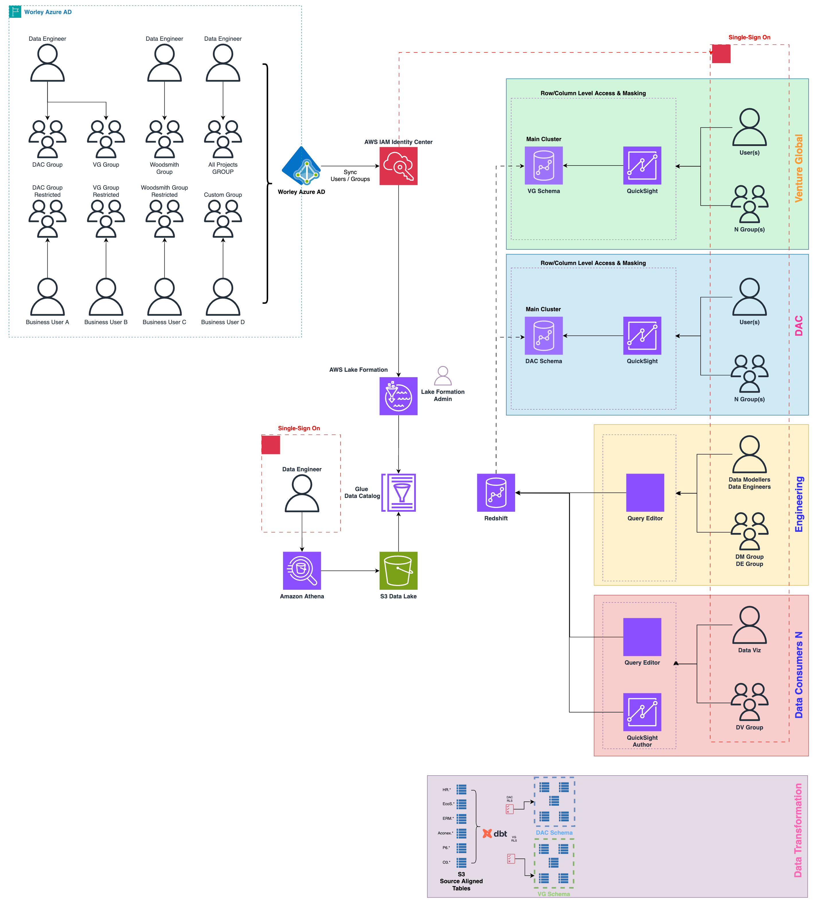
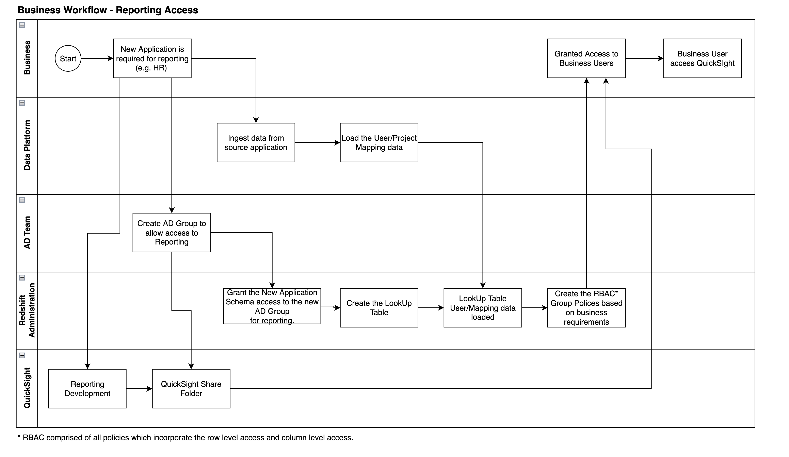
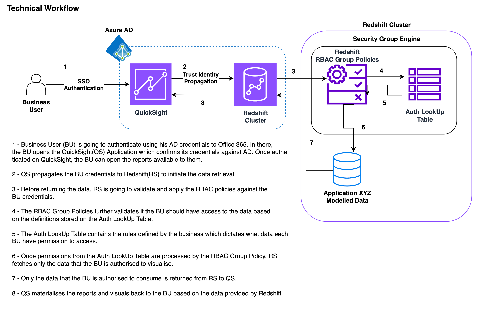
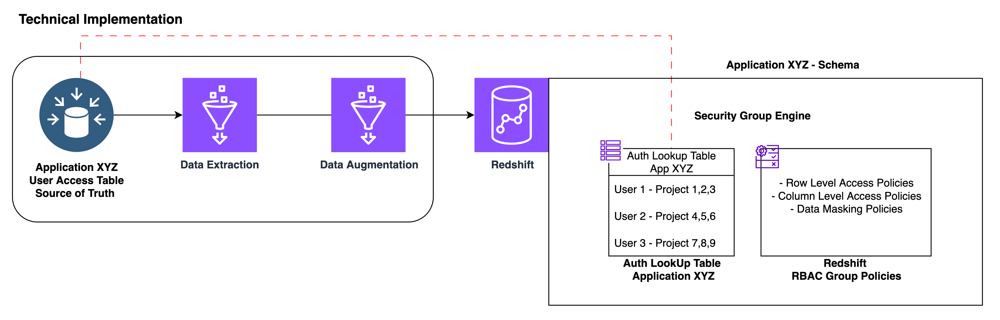

## Security Requirements

1. All user access to data (both modelled and raw data) will be via Redshift to provide a single point of entry.
2. Row-level security - Access on platform and via analytics is restricted based on source application user access
3. Row-level security - Access on platform and via analytics is restricted based on individual (report specific) security groups maintained manually by the business. 
4. Row-level security - Access on platform and via analytics is restricted based on Excel maintained manually by data owners/approvers and ingested in central db repo.  
5. Row-level security - Analytics/output can be published to external users and maintain individual user/group row-level security
6. Column-level security - Sensitive data is obfuscated (e.g. masked) on platform and via analytics and only visible to authorized users. Preferably using Format Preserving Encryption to ensure sensitive data is protected at all times and only decrypted at consumption.
7. Sensitive project data (e.g. DAC) can be containerized by project to segregate from other data on platform
8. System-to-system integrations for data sync between data platform and end applications (not users)
9. End-to-end encryption to protect data at rest and in transit
10. Separation of duties, security policies are maintained outside platform
11. Provide detailed logging and auditing capabilities for monitoring fine-grained access control activities, user behaviour analytics (UBA), ensuring compliance with organizational policies and regulatory requirements.
12. Provide pro-active user monitoring to block/alert activities.  
13. Soft delete functionality to enable 'right to be forgotten'
14. Data blurring - ensuring individuals can't be identified where a small number of records are queried
15. potential requirement for row/cell level masking for sensitive project records (e.g. DAC)

## Use Cases - Redshift & QuickSight

Phase 1 - Object Level Security

1) As data consumer or business user I want to access to source aligned tables based on AD Group membership via Redshift Query Editor V2 / QuickSight.

Phase 2  - Row and Column Level Security

2) As data consumer or business user I want to access to DAC data based on AD Group membership via Redshift Query Editor V2 / QuickSight.

## Use Cases - Data Lake Access

Phase 1 - Object Level Security

1) Data Engineer 1 can query source aligned (P6, EcoSys, etc...) tables which are cataloged on Glue and governed via Lake Formation using Athena.

2)  Data Engineer 2 cannot query source aligned (P6, EcoSys, etc...) tables which are cataloged on Glue and governed via Lake Formation using Athena.

Phase 2 - Row and Column Level Security

1)  Data Engineer 1 can query DAC data which are cataloged on Glue and governed via Lake Formation using Athena.

2)  Data Engineer 2 cannot query DAC data which are cataloged on Glue and governed via Lake Formation using Athena

## High-level design

## AD Group requirements 

|Role | Description| Persona|
|---|---|---|
|Lake formation admin | The Role responsible for `granting`/`revoking` data lake permissions| data steward|
|Redshift DBA | The Role responsible for `granting`/`revoking` data warehouse permissions including `rls/cls/ddm` admin of  policies | data steward|
|${source_aligned}_data_source_access|AD Group who is authorized to access the data source|data consumer|
|${data_product}_access| AD Group who is authorized to access data product i.e. dac-schema| business user

### Business workflow for Reporting access via Redshift 

### Technical Workflow - Redshift  

### Technical Implementation - Redshift 
