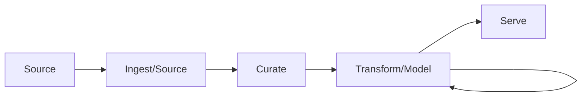
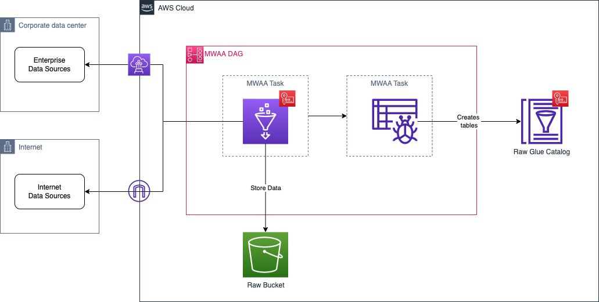
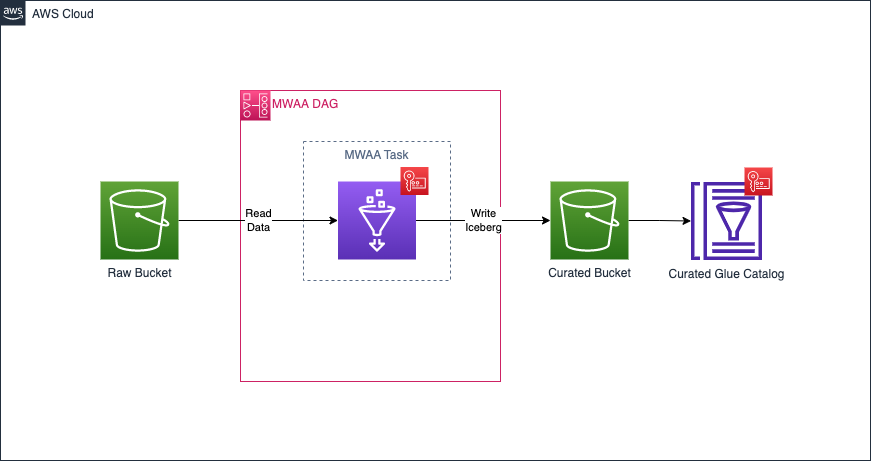
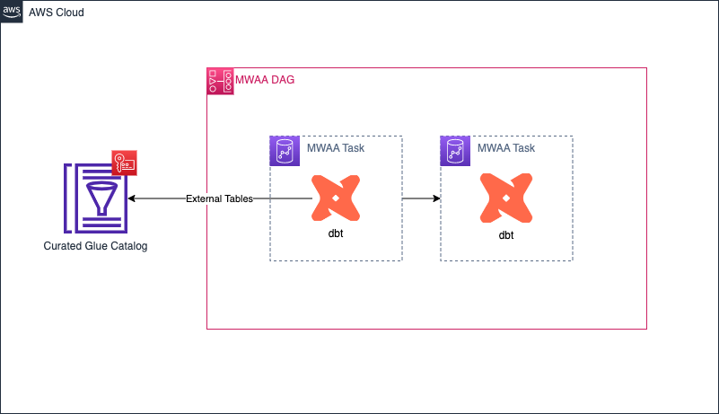
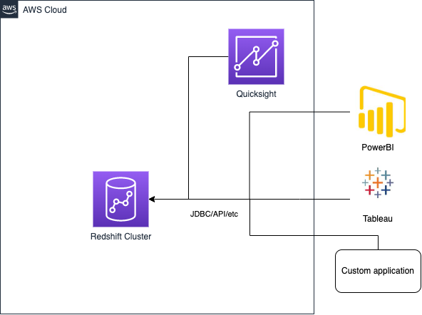

# Data Engineering Concepts

## Introduction
There are logical units of work that need to be developed when creating data products.

1. The platform needs to **ingest** data from source systems.
2. The platform needs to **curate** the ingested data to make it readily available for downstream consumers.
3. The platform needs to **model** the curated data to embed business rules and definitions
4. The platform needs to **serve** the available data to all platform users.

All of the above need to happen in a **secure** and **governed** way.

## Source/Ingest
This step refers to bringing data from the Source (Databases, APIs, CSV, etc) to the Raw layer.

<figure markdown="span">
  { width="500" }
  <figcaption>Data Ingestion/Sourcing</figcaption>
</figure>

## Curation
This steps refers to curating the data available in the `raw` layer.

<figure markdown="span">
  { width="500" }
  <figcaption>Data Curation</figcaption>
</figure>

The data curation process can involve multiple steps such as:

1. Conversion to Iceberg **(mandatory)**
2. Data integrity checks **(optional)**
3. Light -table level- transformations **(optional)**
4. SCD Type I/II **(optional)**

As time progresses the curation process will mature.

## Transformation/Model
This steps refer to transforming the data to adhere to the business model.

<figure markdown="span">
  { width="500" }
  <figcaption>Data Transformation</figcaption>
</figure>

## Serve

??? warning
    This is under construction

<figure markdown="span">
  { width="500" }
  <figcaption>Data Serving</figcaption>
</figure>
