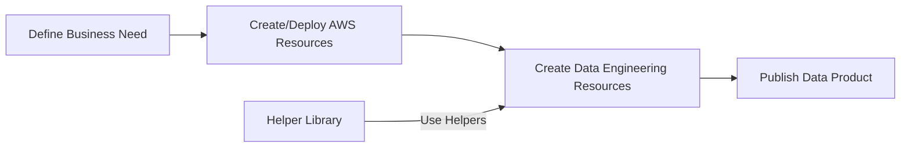
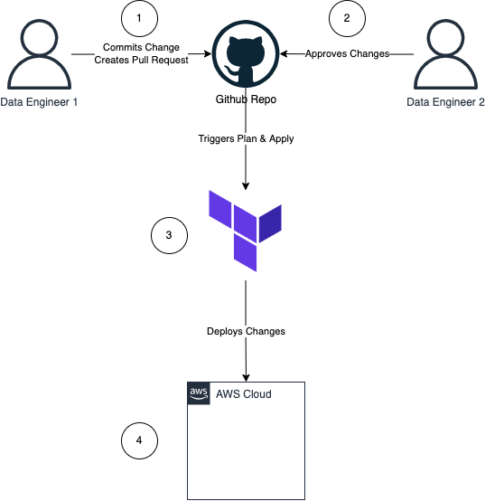

# Data Engineering Process

There are three components to the platform

1. AWS Infrastructure
2. Data & Analytics Resources
3. Helper Utilities

To develop a new data product, you need to firstly deploy the required AWS resources (AWS Glue Database, AWS Glue Jobs, AWS Glue Crawlers, AWS Glue Connection*). The combination of these resources gives you the tools to be able to source a new dataset, curate it, and make it available to your Data Warehouse.

Then, you develop your data engineering workload (AWS Glue Jobs, `dbt` models or reporting Dashboards). Here you should aim to leverage the Helper utilities to speed up development.

Finally, you circle back any new addition to the helper utilities

#### Data Product Lifecycle

## DevOps Process - Automation to Deploy AWS Resources
[DevOps](https://aws.amazon.com/devops/what-is-devops/) is the combination of cultural philosophies, practices, and tools that increases an organization’s ability to deliver applications and services at high velocity: evolving and improving products at a faster pace than organizations using traditional software development and infrastructure management processes. This speed enables organizations to better serve their customers and compete more effectively in the market.

Below is a high level diagram of the process:

<figure markdown="span">
  { width="300" }
  <figcaption>DevOps Process</figcaption>
</figure>

The flow is the following:

1. The Data Engineer makes the required changes to the infrastructure to create their desired AWS resources using Terraform. They then commit the changes to the repository and raises a Pull Request (PR).
2. A team member peer reviews the Pull Request and `approves` it. They can also `request for changes` or reject it. This gate is used to inject proper governance controls
3. Once the PR is approved and merged, an automation process is triggered to initiate the deployment of the resources by leveraging Terraform Cloud
4. Terraform Cloud runs the `plan` command and when successful, runs the `apply` command. After this, the Data Engineer has their set of Enterprise approved resources.

## DataOps - Automation to Deploy Data Engineering Resources
Data Engineering resources refer to the different components that are required to perform `ETL`/`ELT` workloads and/or to develop reporting products.

The current data platform includes automation to allow developers to focus on fulfilling business needs and not worry about their process all whilst mantaining governance and controls.
