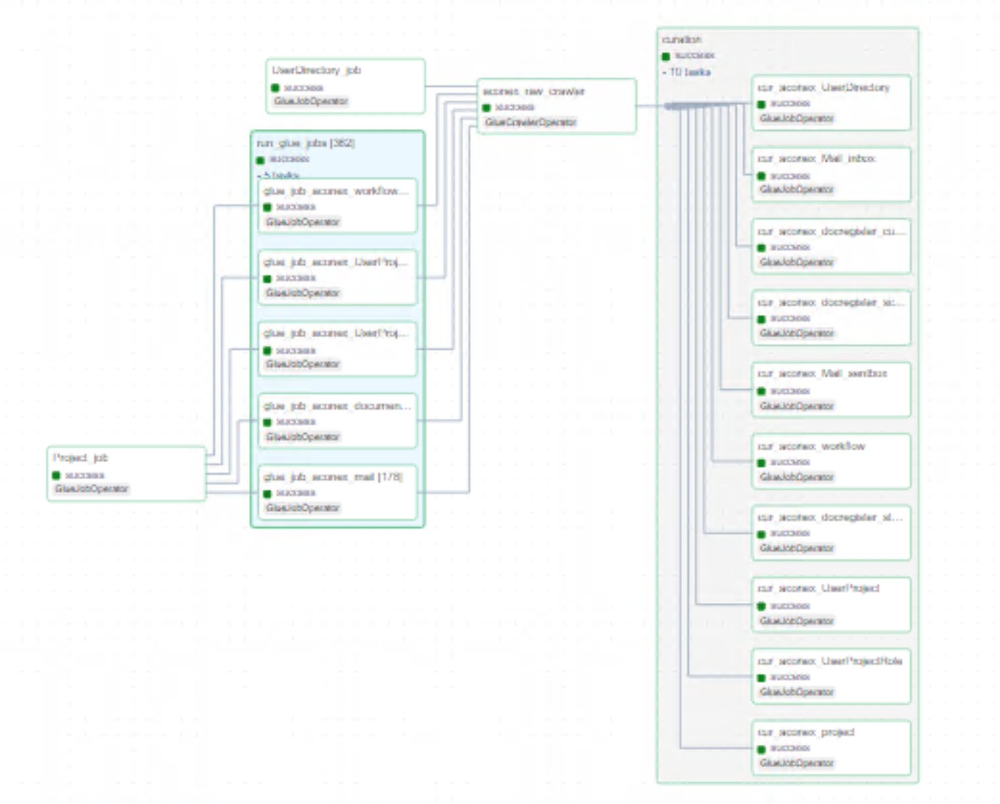

# Overview of Aconex

Aconex serves as a data source from which we retrieve data via an API, receiving responses in a XML format. We authenticate using a BasicAuth, where we take username/password from Secret Manager. This automated code takes projectID as argument, runs all the necessary API calls to process the data, and stores the results in PARQUET format.

Multiple AWS Glue jobs run in parallel for different tables, storing information in S3. Logs are recorded in CloudWatch, and metadata for these jobs is stored in DynamoDB. All paths and parameters are fully parameterized. Credentials for token generation, such as client ID and secret ID, are securely stored in AWS Secrets Manager.

## Metadata files

### Raw Layer Metadata Example

```yaml
---

---
SourceSystemId: aconex
MetadataType: api#aconex#workflow
api_parameter:
  api_body: 
  api_exponential_backoff: 3
  api_headers:
    Content-Type: application/xml
  api_method: get
  api_query_params: 
  api_response_type: xml
  api_retry: 3
  api_ssl_verify: False
  api_timeout: 360
  auth_type: Basic
  endpoint_prefix: https://
  endpoint_suffix: "/api/projects"
  secret_key: Worley-datalake-sydney-dev-db-aconex
aws_region: ap-southeast-2
is_active: "y"
job_parameter:
  bucket_data_source_prefix: aconex
  bucket_name: worley-datalake-sydney-dev-bucket-raw-xd5ydg
  full_incr: i
  incremental_criteria_folder_location: aconex/workflow_audit_folder
  incremental_default_date: '20200101'
  input_path: temp/aconex/workflow
  kms_key_id: 3a4345c9-617f-4e55-8a27-70814760f56a
  output_s3: aconex
  root_tag: Workflow
  row_tag: Workflow
  sampling_fraction: '0.5'
  sampling_seed: 42
  schema_output_s3: aconex/data_sampling
name: workflow
page_size: 500

---
```

### Curation Layer Metadata Example

```yaml
---
---
SourceSystemId: aconex_curated
MetadataType: curated#aconex#workflow#job#iceberg
source:
  name: aconex_workflow
  compute_engine: spark
  spark_options:
    format: parquet
  glue_options:
    connection_type: s3
    connection_options: s3://worley-datalake-sydney-dev-bucket-raw-xd5ydg/aconex/workflow/
    format: parquet
    format_options:
      mergeSchema: true
    transformation_ctx: aconex-workflow
transforms:
- transform: rename_columns
  rename_column: true
- transform: select_columns_from_config_file
  select_columns: true
- transform: change_data_types
  change_types: true
- transform: add_run_date
  column_name: EXECUTION_DATE
  date_format: yyyy-MM-dd
- transform: custom_sql
  sql: SELECT *, 'aconex' as SOURCE_SYSTEM_NAME FROM temp_df_static
  temp_view_name: temp_df_static
target:
  name: curated_aconex_workflow
  compute_engine: spark
  iceberg_properties:
    database_name: worley_datalake_sydney_dev_glue_catalog_database_aconex
    table_name: curated_workflow
    iceberg_configuration:
      create_table: true
      iceberg_catalog_warehouse: worley-datalake-sydney-dev-bucket-curated-xd5ydg/aconex/workflow/
      table_properties:
        write.format.default: parquet
        format-version: '2'
  load_type: incremental
  primary_key: [WorkflowId,projectid,Assignee_UserId]
  spark_options:
    format: iceberg
    options:
      path: s3://worley-datalake-sydney-dev-bucket-curated-xd5ydg/aconex/workflow
table_schema:
  schema_properties:
    enforce: true
    primary_key: [WorkflowId,projectid,Assignee_UserId]
    rename_columns: true
  columns:
  - column_name:  Comments  
    column_data_type:   string 
    nullable: true
    comment:  Comments  
    data_classification: null
    raw_column_name:   comments   
  - column_name:  DateCompleted 
    column_data_type:   string 
    nullable: true
    comment:  DateCompleted 
    data_classification: null
    raw_column_name:   datecompleted    
  - column_name:  DateDue 
    column_data_type:   string 
    nullable: true
    comment:  DateDue 
    data_classification: null
    raw_column_name:   datedue    
  - column_name:  DateIn  
    column_data_type:   string 
    nullable: true
    comment:  DateIn  
    data_classification: null
    raw_column_name:   datein   
  - column_name:  DaysLate  
    column_data_type:   bigint 
    nullable: true
    comment:  DaysLate  
    data_classification: null
    raw_column_name:   dayslate   
  - column_name:  DocumentNumber  
    column_data_type:   string 
    nullable: true
    comment:  DocumentNumber  
    data_classification: null
    raw_column_name:   documentnumber   
  - column_name:  DocumentTitle 
    column_data_type:   string 
    nullable: true
    comment:  DocumentTitle 
    data_classification: null
    raw_column_name:   documenttitle    
  - column_name:  DocumentTrackingId  
    column_data_type:   long 
    nullable: true
    comment:  DocumentTrackingId  
    data_classification: null
    raw_column_name:   documenttrackingid   
  - column_name:  DocumentVersion 
    column_data_type:   long 
    nullable: true
    comment:  DocumentVersion 
    data_classification: null
    raw_column_name:   documentversion    
  - column_name:  Duration  
    column_data_type:   float 
    nullable: true
    comment:  Duration  
    data_classification: null
    raw_column_name:   duration   
  - column_name:  FileName  
    column_data_type:   string 
    nullable: true
    comment:  FileName  
    data_classification: null
    raw_column_name:   filename   
  - column_name:  FileSize  
    column_data_type:   long 
    nullable: true
    comment:  FileSize  
    data_classification: null
    raw_column_name:   filesize 
  - column_name:  Initiator_Name  
    column_data_type:   string 
    nullable: true
    comment:  Initiator_Name  
    data_classification: null
    raw_column_name:   initiator_name   
  - column_name:  Initiator_OrganizationId  
    column_data_type:   long 
    nullable: true
    comment:  Initiator_OrganizationId  
    data_classification: null
    raw_column_name:   initiator_organizationid   
  - column_name:  Initiator_OrganizationName  
    column_data_type:   string 
    nullable: true
    comment:  Initiator_OrganizationName  
    data_classification: null
    raw_column_name:   initiator_organizationname   
  - column_name:  Initiator_UserId  
    column_data_type:   long 
    nullable: true
    comment:  Initiator_UserId  
    data_classification: null
    raw_column_name:   initiator_userid   
  - column_name:  OriginalDueDate 
    column_data_type:   string 
    nullable: true
    comment:  OriginalDueDate 
    data_classification: null
    raw_column_name:   originalduedate    
  - column_name:  ReasonForIssue  
    column_data_type:   string 
    nullable: true
    comment:  ReasonForIssue  
    data_classification: null
    raw_column_name:   reasonforissue   
  - column_name:  RelatedSupplierDocumentPackage  
    column_data_type:   string 
    nullable: true
    comment:  RelatedSupplierDocumentPackage  
    data_classification: null
    raw_column_name:   relatedsupplierdocumentpackage   
  - column_name:  Reviewer_Name 
    column_data_type:   string 
    nullable: true
    comment:  Reviewer_Name 
    data_classification: null
    raw_column_name:   reviewer_name    
  - column_name:  Reviewer_OrganizationId 
    column_data_type:   long 
    nullable: true
    comment:  Reviewer_OrganizationId 
    data_classification: null
    raw_column_name:   reviewer_organizationid    
  - column_name:  Reviewer_OrganizationName 
    column_data_type:   string 
    nullable: true
    comment:  Reviewer_OrganizationName 
    data_classification: null
    raw_column_name:   reviewer_organizationname    
  - column_name:  Reviewer_UserId 
    column_data_type:   long 
    nullable: true
    comment:  Reviewer_UserId 
    data_classification: null
    raw_column_name:   reviewer_userid    
  - column_name:  StepName  
    column_data_type:   string 
    nullable: true
    comment:  StepName  
    data_classification: null
    raw_column_name:   stepname   
  - column_name:  StepOutcome 
    column_data_type:   string 
    nullable: true
    comment:  StepOutcome 
    data_classification: null
    raw_column_name:   stepoutcome    
  - column_name:  StepStatus  
    column_data_type:   string 
    nullable: true
    comment:  StepStatus  
    data_classification: null
    raw_column_name:   stepstatus   
  - column_name:  WorkflowName  
    column_data_type:   string 
    nullable: true
    comment:  WorkflowName  
    data_classification: null
    raw_column_name:   workflowname   
  - column_name:  WorkflowNumber  
    column_data_type:   string 
    nullable: true
    comment:  WorkflowNumber  
    data_classification: null
    raw_column_name:   workflownumber   
  - column_name:  WorkflowStatus  
    column_data_type:   string 
    nullable: true
    comment:  WorkflowStatus  
    data_classification: null
    raw_column_name:   workflowstatus   
  - column_name:  WorkflowTemplate  
    column_data_type:   string 
    nullable: true
    comment:  WorkflowTemplate  
    data_classification: null
    raw_column_name:   workflowtemplate   
  - column_name:  WorkflowId  
    column_data_type:   long 
    nullable: true
    comment:  WorkflowId  
    data_classification: null
    raw_column_name:   _workflowid    
  - column_name:  ParentWorkflowId  
    column_data_type:   long 
    nullable: true
    comment:  ParentWorkflowId  
    data_classification: null
    raw_column_name:   parentworkflowid   
  - column_name:  Assignee_Name 
    column_data_type:   string 
    nullable: true
    comment:  Assignee_Name 
    data_classification: null
    raw_column_name:   assignee_name    
  - column_name:  Assignee_OrganizationName 
    column_data_type:   string 
    nullable: true
    comment:  Assignee_OrganizationName 
    data_classification: null
    raw_column_name:   assignee_organizationname    
  - column_name:  Assignee_OrganizationId 
    column_data_type:   long 
    nullable: true
    comment:  Assignee_OrganizationId 
    data_classification: null
    raw_column_name:   assignee_organizationid    
  - column_name:  Assignee_UserId 
    column_data_type:   long 
    nullable: true
    comment:  Assignee_UserId 
    data_classification: null
    raw_column_name:   assignee_userid    
  - column_name:  projectid 
    column_data_type:   long 
    nullable: true
    comment:  projectid 
    data_classification: null
    raw_column_name:   projectid    
  - column_name:  DocumentRevision  
    column_data_type:   string 
    nullable: true
    comment:  DocumentRevision  
    data_classification: null
    raw_column_name:   documentrevision   

```

## Aconex Pipeline




The aconex pipeline consists of 3 important tasks:

- Triggers the raw layer Glue job to process API data.
- Triggers the schema change detection Glue job to compare schema between current and previous versions.
- Triggers the curation layer Glue job that creates iceberg tables.


## Process to onboard new tables to Aconex

- Create metadata for that table. Run the Glue job by passing the project ID to it.
- Add a new metadata file in curation layer defining raw layer to curation layer column mappings.
- Add the table name to the Airflow DAG `aconex_pipeline.py`.
