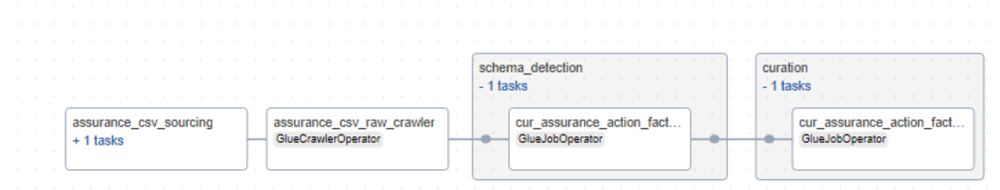

# Overview of Assurance

Assurance is a datasource that is SFTP server based. The datasource consists of CSV files. In an ideal scenario, Assurance generates 148 CSV files. The datasource wraps all the CSV files into a single zip archive. Assurance has a global namespace and is not project specific unlike E3D or Sharepoint. The schema (headers of CSV files) of the 148 files can be different from each other.

Currently, the CSV files are uploaded manually to a S3 bucket and these files are consumed by raw layer and curation layer Glue jobs. However, future scope may involve logic (possibly using AppFlow connector and Airflow Dag combination) that fetches the zip archive from SFTP and places the unzipped CSV files on S3.

The CSV files are processed sequentially within the raw layer Glue job and diagnostic information such as missing rows or empty CSV files are logged using CloudWatch logs. The CSV files are processed by a generic raw layer Glue job that uses metadata configuration to get contextual information of the CSV files. The generic Glue job is designed to handle any other datasources that generate CSV files similar to Assurance. The curation layer Glue job is also generic in nature and handles the transformations using the metadata configuration of the curation layer.

## Metadata files

The table below explains the purpose of some the important parameters.

| **Filename**                                  | **Description**                                                                                                                                                      |
|:----------------------------------------------|:--------------------------------------------------------------------------------------------------------------------------------------------------------------------|
| `sampling_fraction and sampling_seed`          | These parameters are used to collect a sample set of data which is further used to detect schema changes.                                                          |
| `replace_non_alphanumeric_with_underscore`     | If the raw layer columns contain non alphanumeric characters they will be replaced by an underscore `_`.                                                        |
| `is_fixed_file_name, file_prefix_length, file_suffix_length` | In some cases the file name may end with varying date and time stamps. In order to generically identify and parse files these parameters are used.        |
| `separator`                                   | The CSV files can have various separators such as comma-separated, tab-separated, or pipe-separated.                                                               |


Below is a sample raw layer metadata file.


### Raw Layer Metadata Example

```yaml
---
SourceSystemId: assurance
MetadataType: csv#assurance
aws_region: ap-southeast-2
Env: dev
is_active: 'y'
job_parameter:
  bucket_name: <raw-layer-bucket-name>
  csv_files_path: assurance/csv/
  drop_duplicate_columns: true
  drop_duplicate_rows: true
  parquet_files_path: assurance/parquet/
  raw_files_path: assurance/raw/
  replacement_char: _
  replace_non_alphanumeric_with_underscore: true
  replace_non_printable_ascii_with_underscore: false
  sample_data_location: assurance/data_sampling
  sampling_fraction: '0.5'
  sampling_seed: 42
  specialchars_to_be_replaced_in_columnnames: []
  csv_files:
    - filename: dataextract_rt_action_factors_training_and_competence_20240506_1944.csv
      file_prefix_length: 0
      file_suffix_length: 14
      is_fixed_file_name: false
      multiline: true
      quote_character: '"'
      separator: '|'
      tablename: action_factors_training_and_competence
      with_header: true
    - filename: dataextract_rt_assessment_finding_20240506_1944.csv
      file_prefix_length: 0
      file_suffix_length: 14
      is_fixed_file_name: false
      multiline: true
      quote_character: '"'
      separator: '|'
      tablename: assessment_finding
      with_header: true
      
name: assurance
Namespace: global

```

### Curation Layer Metadata Example

```yaml
---
SourceSystemId: assurance_curated
MetadataType: curated#assurance#action_factors_training_and_competence#job#iceberg
source:
  compute_engine: spark
  glue_options:
    connection_options: s3://<raw-layer-bucket-name>/assurance/parquet/action_factors_training_and_competence.parquet/
    connection_type: s3
    format: parquet
    transformation_ctx: action_factors_training_and_competence
    format_options:
      mergeSchema: true
  name: action_factors_training_and_competence
  spark_options:
    format: parquet
table_schema:
  columns:
  - column_data_type: decimal(32,0)
    column_name: dwk_action
    comment: dwk_action
    data_classification: 
    nullable: false
    raw_column_name: dwk_action
  - column_data_type: string
    column_name: factors_training_and_competence
    comment: factors_training_and_competence
    data_classification: 
    nullable: true
    raw_column_name: factors_training_and_competence
  - column_data_type: string
    column_name: li_factors_training_and_competence
    comment: li_factors_training_and_competence
    data_classification: 
    nullable: false
    raw_column_name: li_factors_training_and_competence
  - column_data_type: decimal(32,0)
    column_name: lo_factors_training_and_competence
    comment: lo_factors_training_and_competence
    data_classification: 
    nullable: true
    raw_column_name: lo_factors_training_and_competence
  - column_data_type: timestamp
    column_name: bms_lastmodified
    comment: bms_lastmodified
    data_classification: 
    nullable: true
    raw_column_name: bms_lastmodified
  schema_properties:
    enforce: true
    rename_columns: true
    primary_key: [dwk_action,li_factors_training_and_competence]
target:
  compute_engine: spark
  iceberg_properties:
    database_name: worley_datalake_sydney_dev_glue_catalog_database_assurance
    iceberg_configuration:
      create_table: true
      iceberg_catalog_warehouse: <curated-layer-bucket-name>/assurance/action_factors_training_and_competence/
      table_properties:
        format-version: '2'
        write.format.default: parquet
    table_name: curated_action_factors_training_and_competence
  name: curated_action_factors_training_and_competence
  spark_options:
    format: iceberg
    options:
      path: s3://<curated-layer-bucket-name>/assurance/action_factors_training_and_competence
  load_type: incremental
  primary_key: [dwk_action,li_factors_training_and_competence]
transforms:
- rename_column: true
  transform: rename_columns
- select_columns: true
  transform: select_columns_from_config_file
- change_types: true
  transform: change_data_types
- column_name: EXECUTION_DATE
  date_format: yyyy-MM-dd
  transform: add_run_date
- sql: SELECT *, 'assurance' as SOURCE_SYSTEM_NAME FROM temp_df_static
  temp_view_name: temp_df_static
  transform: custom_sql

```

## Assurance Pipeline




The assurance pipeline consists of 3 important tasks:

- Triggers the raw layer Glue job to process CSV files.
- Triggers the schema change detection Glue job to compare schema between current and previous versions.
- Triggers the curation layer Glue job that creates iceberg tables.


## Key Files Handling Assurance Files Processing

| **Filename**                          | **Description**                                                                                                                                                                                                                      |
|:--------------------------------------|:------------------------------------------------------------------------------------------------------------------------------------------------------------------------------------------------------------------------------------|
| `assurance_csv_pipeline.py`            | The Airflow DAG pipeline for handling Assurance files processing.                                                                                                                                                                   |
| `convert_csv_and_xlsx_to_parquet.py`   | Generic Glue job that converts CSV and XLSX files to Parquet format. Expects the following gluejob input parameters: `--source_name:assurance, --metadata_type:csv#assurance, --function_name:csv, --metadata_table_name:<dynamodb_tablename>` |
| `schema_change_detection_generic.py`   | Generic Glue job that detects schema changes between current and previous versions. Expects the following gluejob input parameters: `--catalog_db:<glue_catalogue_db_for_assurance>, --table_name:<raw_table_name_of_the_csv_file>`        |
| `raw_curated_generic.py`               | Generic Glue job that creates iceberg tables. Expects the following gluejob input parameters: `--source_system_id: assurance_curated, --metadata_type: curated#assurance#<table_name_of_the_csv_file>#job#iceberg, --metadata_table_name:<dynamodb_tablename>`. |


## Process to onboard new files to Assurance

- Add the metadata of the new file to raw layer metadata file.
- Add a new metadata file in curation layer defining raw layer to curation layer column mappings.
- Add the curation layer table to the Airflow DAG `assurance_csv_pipeline.py`.

## Future Scope

- Connector functionality to fetch ZIP files from SFTP server, unzip it and upload it to S3.
- Customizing raw layer metadata configuration to dynamically decide if Glue job processing should exit in the event of errors originating from one or more CSV files or gracefully catch the errors and continue processing rest of the files.
