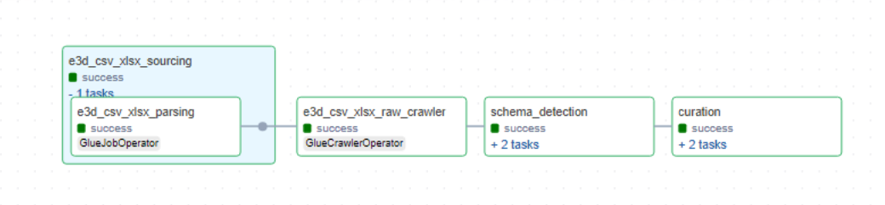

# Overview of E3D

E3D is a datasource that is hosted on on-prem Windows Fileshare. The datasource consists of CSV and XLSX files. E3D is scoped to a project, such as "VG" or "DAC" etc. 

Currently, the CSV and XLSX files are uploaded manually to a S3 bucket and these files are consumed by raw layer and curation layer Glue jobs. However, future scope may involve logic (possibly using AppFlow connector and Airflow Dag combination) that fetches the CSV and XLSX files and places them on S3.

The CSV and XLSX files are processed sequentially within the raw layer Glue job and diagnostic information such as missing rows or empty files are logged using CloudWatch logs. The files are processed by a generic raw layer Glue job that uses metadata configuration to get contextual information of the files. The generic Glue job is designed to handle any other datasources that generate CSV or XLSX files similar to E3D. The curation layer Glue job is also generic in nature and handles the transformations using the metadata configuration of the curation layer.

## Metadata files

The table below explains the purpose of some the important parameters.

| **Filename**                                  | **Description**                                                                                                                                                      |
|:----------------------------------------------|:--------------------------------------------------------------------------------------------------------------------------------------------------------------------|
| `sampling_fraction and sampling_seed`          | These parameters are used to collect a sample set of data which is further used to detect schema changes.                                                          |
| `replace_non_alphanumeric_with_underscore`     | If the raw layer columns contain non alphanumeric characters they will be replaced by an underscore `_`.                                                        |
| `is_fixed_file_name, file_prefix_length, file_suffix_length` | In some cases the file name may end with varying date and time stamps. In order to generically identify and parse files these parameters are used.        |
| `separator`                                   | The CSV files or the sheets within XLSX can have various separators such as comma-separated, tab-separated, or pipe-separated.                                                               |


Below is a sample raw layer metadata file.


### Raw Layer Metadata Example

```yaml
---
SourceSystemId: e3d
MetadataType: csv_xlsx#vg#e3d
aws_region: ap-southeast-2
Env: dev
is_active: 'y'
job_parameter:
  bucket_name: <raw_layer_bucket>
  csv_files_path: vg/e3d/csv/
  drop_duplicate_columns: true
  drop_duplicate_rows: true
  parquet_files_path: vg/e3d/parquet/
  raw_files_path: vg/e3d/raw/
  replacement_char: _
  replace_non_alphanumeric_with_underscore: true
  replace_non_printable_ascii_with_underscore: false
  sample_data_location: vg/e3d/data_sampling
  sampling_fraction: '0.5'
  sampling_seed: 42
  specialchars_to_be_replaced_in_columnnames: []
  csv_files:
    - filename: PipeCompWbsRep.csv
      is_fixed_file_name: true
      file_prefix_length: 0
      file_suffix_length: 0
      multiline: true
      quote_character: '"'
      separator: ','
      tablename: pipecompwbsrep
      with_header: true
  xls_files:
    - filename: VGL-EQUIP-18062024.xlsx
      file_prefix_length: 0
      file_suffix_length: 9
      is_fixed_file_name: false
      xls_engine_name: openpyxl
      sheets:
        - sheet_name: Sheet1
          tablename: vg_e3d_vglequip_sheet
          quote_character: '"'
          separator: ','
          multiline: true
          header_row: 0
          header_column: 0
          data_start_row: 0
          data_start_column: 0


name: e3d
Namespace: vg


```

### Curation Layer Metadata Example

```yaml
---
---
SourceSystemId: e3d_curated
MetadataType: curated#vg_E3D#pipecompwbsrep#job#iceberg
source:
  compute_engine: spark
  glue_options:
    connection_options: s3://<raw_layer_bucket>/vg/e3d/parquet/pipecompwbsrep.parquet/
    connection_type: s3
    format: parquet
    transformation_ctx: vg_E3D-csv_xlsx_curated
  name: vg_E3D_csv_xlsx_curated
  spark_options:
    format: parquet
table_schema:
  columns:
  - column_data_type: string
    column_name: WBS
    comment: WBS
    data_classification: 
    nullable: true
    raw_column_name: wbs
  - column_data_type: string
    column_name: SITE
    comment: SITE
    data_classification: 
    nullable: true
    raw_column_name: site
  - column_data_type: string
    column_name: ZONE
    comment: ZONE
    data_classification: 
    nullable: true
    raw_column_name: zone
  - column_data_type: string
    column_name: PIPE
    comment: PIPE
    data_classification: 
    nullable: true
    raw_column_name: pipe
  - column_data_type: string
    column_name: BRANCH
    comment: BRANCH
    data_classification: 
    nullable: true
    raw_column_name: branch
  - column_data_type: string
    column_name: TYPE
    comment: TYPE
    data_classification: 
    nullable: true
    raw_column_name: type
  - column_data_type: string
    column_name: REF
    comment: REF
    data_classification: 
    nullable: true
    raw_column_name: ref
  - column_data_type: string
    column_name: TAG
    comment: TAG
    data_classification: 
    nullable: true
    raw_column_name: tag
  - column_data_type: string
    column_name: SPREF
    comment: SPREF
    data_classification: 
    nullable: true
    raw_column_name: spref
  - column_data_type: string
    column_name: ISPEC
    comment: ISPEC
    data_classification: 
    nullable: true
    raw_column_name: ispec
  - column_data_type: string
    column_name: NB1
    comment: NB1
    data_classification: 
    nullable: true
    raw_column_name: nb1
  - column_data_type: string
    column_name: NB2
    comment: NB2
    data_classification: 
    nullable: true
    raw_column_name: nb2
  - column_data_type: string
    column_name: NB3
    comment: NB3
    data_classification: 
    nullable: true
    raw_column_name: nb3
  - column_data_type: string
    column_name: NB4
    comment: NB4
    data_classification: 
    nullable: true
    raw_column_name: nb4
  - column_data_type: string
    column_name: LENGTH
    comment: LENGTH
    data_classification: 
    nullable: true
    raw_column_name: length
  - column_data_type: string
    column_name: DESCRIPTION
    comment: DESCRIPTION
    data_classification: 
    nullable: true
    raw_column_name: description
  - column_data_type: string
    column_name: MATERIAL
    comment: MATERIAL
    data_classification: 
    nullable: true
    raw_column_name: material
  - column_data_type: string
    column_name: IDCODE
    comment: IDCODE
    data_classification: 
    nullable: true
    raw_column_name: idcode
  - column_data_type: string
    column_name: CMCODE
    comment: CMCODE
    data_classification: 
    nullable: true
    raw_column_name: cmcode
  - column_data_type: string
    column_name: LINENO
    comment: LINENO
    data_classification: 
    nullable: true
    raw_column_name: lineno
  - column_data_type: string
    column_name: DUTY
    comment: DUTY
    data_classification: 
    nullable: true
    raw_column_name: duty
  - column_data_type: string
    column_name: WGT
    comment: WGT
    data_classification: 
    nullable: true
    raw_column_name: wgt_lbs
  - column_data_type: string
    column_name: WGT_LBS_W_INSU
    comment: WGT_LBS_W_INSU
    data_classification: 
    nullable: true
    raw_column_name: wgt_lbs_w_insu
  - column_data_type: string
    column_name: EWP
    comment: EWP
    data_classification: 
    nullable: true
    raw_column_name: ewp_ewp
  - column_data_type: string
    column_name: CWA
    comment: CWA
    data_classification: 
    nullable: true
    raw_column_name: cwa_cwarea
  - column_data_type: string
    column_name: CWP
    comment: CWP
    data_classification: 
    nullable: true
    raw_column_name: cwp_workpackno
  - column_data_type: string
    column_name: CWPZONE
    comment: CWPZONE
    data_classification: 
    nullable: true
    raw_column_name: cwpzone_areacode
  - column_data_type: string
    column_name: ISO
    comment: ISO
    data_classification: 
    nullable: true
    raw_column_name: iso
  - column_data_type: string
    column_name: DRAWING_NO
    comment: DRAWING_NO
    data_classification: 
    nullable: true
    raw_column_name: drawing_no
  - column_data_type: string
    column_name: P_ID_LINE_NO
    comment: P_ID_LINE_NO
    data_classification: 
    nullable: true
    raw_column_name: p_id_line_no
  - column_data_type: string
    column_name: P_ID_REFERENCE
    comment: P_ID_REFERENCE
    data_classification: 
    nullable: true
    raw_column_name: p_id_reference
  schema_properties:
    enforce: true
    rename_columns: true
target:
  compute_engine: spark
  iceberg_properties:
    database_name: worley_datalake_sydney_dev_glue_catalog_database_vg_e3d
    iceberg_configuration:
      create_table: true
      iceberg_catalog_warehouse: <curated_layer_bucket>/vg/e3d/pipecompwbsrep/
      table_properties:
        format-version: '2'
        write.format.default: parquet
    table_name: curated_pipecompwbsrep
  name: curated_vg_E3D_pipecompwbsrep
  load_type: append
  spark_options:
    format: iceberg
    options:
      path: s3://<curated_layer_bucket>/vg/e3d/pipecompwbsrep
transforms:
- rename_column: true
  transform: rename_columns
- select_columns: true
  transform: select_columns_from_config_file
- change_types: true
  transform: change_data_types
- column_name: EXECUTION_DATE
  date_format: yyyy-MM-dd
  transform: add_run_date
- sql: SELECT *, 'vg_E3D' as SOURCE_SYSTEM_NAME FROM temp_df_static
  temp_view_name: temp_df_static
  transform: custom_sql


```

## E3D Pipeline




The E3D pipeline consists of 3 important tasks:

- Triggers the raw layer Glue job to process CSV and XLSX files.
- Triggers the schema change detection Glue job to compare schema between current and previous versions.
- Triggers the curation layer Glue job that creates iceberg tables.


## Key Files Handling E3D Files Processing

| **Filename**                          | **Description**                                                                                                                                                                                                                      |
|:--------------------------------------|:------------------------------------------------------------------------------------------------------------------------------------------------------------------------------------------------------------------------------------|
| `e3d_csv_and_xlsx_pipeline.py`            | The Airflow DAG pipeline for handling E3D files processing.                                                                                                                                                                   |
| `convert_csv_and_xlsx_to_parquet.py`   | Generic Glue job that converts CSV and XLSX files to Parquet format. Expects the following gluejob input parameters: `--source_name:e3d, --metadata_type:csv#e3d, --function_name:csv, --metadata_table_name:<dynamodb_tablename>` |
| `schema_change_detection_generic.py`   | Generic Glue job that detects schema changes between current and previous versions. Expects the following gluejob input parameters: `--catalog_db:<glue_catalogue_db_for_e3d>, --table_name:<raw_table_name_of_the_csv_file>`        |
| `raw_curated_generic.py`               | Generic Glue job that creates iceberg tables. Expects the following gluejob input parameters: `--source_system_id: e3d_curated, --metadata_type: curated#e3d#<table_name_of_the_csv_file>#job#iceberg, --metadata_table_name:<dynamodb_tablename>`. |


## Process to onboard new files to E3D

- Add the metadata of the new file to raw layer metadata file.
- Add a new metadata file in curation layer defining raw layer to curation layer column mappings.
- Add the curation layer table to the Airflow DAG `e3d_csv_and_xlsx_pipeline.py`.

## Future Scope

- Connector functionality to fetch CSV and XLSX files from the on-prem Windows fileshare and upload it to S3.
- Customizing raw layer metadata configuration to dynamically decide if Glue job processing should exit in the event of errors originating from one or more CSV or XLSX files or gracefully catch the errors and continue processing rest of the files.
