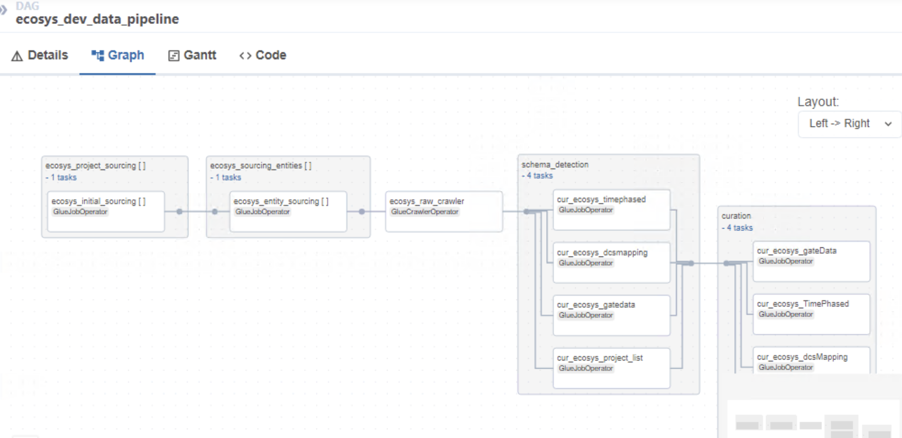

# Overview of Ecosys

Data from Ecosys system is exposed in the form of APIs. The requirement is to extract the data from the given Ecosys APIs and load them to the Datalake tables using AWS glue jobs orchestrated via Airflow .  

Ecosys has two workflows
-First Workflow is a generic workflow which encompasess all the API's which is extracted  at the Universal SecOrg level or without SecOrg
-Second workflow encompases the Project specifc workflow eg:VG,DAC etc .

## API's Info

The table below explains the list of API's , Workflow category, Parameter Passed , API URL , Load Type, Primary Key.

| **APIName**|**WorkflowCategiry**|**Parameter Passed** |**APIURL**|**LoadType** |**PrimaryKey**|**DataLoad**|
|:-----   |:-----   |:-----   |:-----   |:-----   |:-----   |:-----   |
| `project_list`| Project Specific| Source Name , Function Name and SecOrg |https://ecosys-int.worley.com/ecosys/api/restjson/Ecosys_ProjectList/|Incremental|ProjectInternalID|Full|
| `gateData`| Project Specific| Source Name , Function Name and SecOrg |https://ecosys-int.worley.com/ecosys/api/restjson/INTa_DEL_EDSR_Gate_Data/|fullload|No Primary Key|Full|
| `dcsmapping`| Project Specific| Source Name , Function Name and SecOrg |https://ecosys-int.worley.com/ecosys/api/restjson/INTa_DEL_EDSR_DCS_Mapping/|fullload|No Primary Key|Full|
| `timephased`| Project Specific| Source Name , Function Name and SecOrg |https://ecosys-int.worley.com/ecosys/api/restjson/Ecosys_ControlAccount_TimePhased/|fullload+append|No Primary Key|Full|
| `header`| Generic and No SecOrg| Source Name , Function Name and SecOrg |https://ecosys-int.worley.com/ecosys/api/restjson/INTa_SnowFlake_ECOHDR_CO/|Incremental|ProjectInternalID|Full|
| `secorglist`| Generic and No SecOrg| Source Name , Function Name and SecOrg |https://ecosys-int.worley.com/ecosys/api/restjson/INTa_SnowFlake_SecOrgs/|fullload|SecOrgID|Full|
| `snapidlist`| Generic and No SecOrg| Source Name , Function Name and SecOrg |https://ecosys-int.worley.com/ecosys/api/restjson/INTa_SnowFlake_SnapID/|fullload|TransactionCategoryInternalID|Full|
| `snapshotfull`| Generic and SecOrg| Source Name , Function Name and SecOrg |https://ecosys.worley.com/ecosys/api/restjson/INTa_SnowFlake_Snapshot_List_SecOrg/|fullload+append|SnapshotIntID|Full|


Below is a sample raw layer metadata file.


### Raw Layer Metadata Example

```yaml
---
SourceSystemId: ecosys
MetadataType: api#ecosys#project_list
name: project_list
is_active: y
api_parameter:
  api_method: get # Mandatory (Key and Value)
  api_response_type : raw
  endpoint: https://ecosys-int.worley.com/ecosys/api/restjson/Ecosys_ProjectList/ #Mandatory (Key and Value)
  api_auth_type: Basic #Mandatory (Key and Value)
  secret_key: worley-datalake-sydney-dev-api-ecosys  # This goes into SecretsManager (Mandatory) (Key and Value)
  api_ssl_verify : False
  api_retry: 3 #Mandatory (Key and Value)
  api_timeout: 300 #Mandatory (Key and Value)
  api_headers: #Mandatory 
    content_type: application/json #Mandatory (Key and Value)
  dynamic_api_headers: #Mandatory
    Authorization : None #Optional (Key only)
  api_query_params: None #Mandatory (Key only)
  dynamic_api_query_param :  #Optional 
  api_body: None #Mandatory (Key only)
job_parameter:
  bucket_name: worley-datalake-sydney-dev-bucket-raw-xd5ydg
  input_path : None
  full_incr: f
  table_prefix: project_list
  secorg_id : HOUS-B2d90


```

### Curation Layer Metadata Example

```yaml
---
---
SourceSystemId: ecosys_curated
MetadataType: curated#ecosys#project_list#job#iceberg
source:
  name: ecosys_project_list
  compute_engine: spark
  spark_options:
    format: parquet
  glue_options:
    connection_type: s3
    connection_options: s3://worley-datalake-sydney-dev-bucket-raw-xd5ydg/ecosys/project_list/
    format: parquet
    transformation_ctx: ecosys-project_list
transforms:
- transform: rename_columns
  rename_column: true
- transform: select_columns_from_config_file
  select_columns: true
- transform: change_data_types
  change_types: true
- transform: add_run_date
  column_name: EXECUTION_DATE
  date_format: yyyy-MM-dd
- transform: custom_sql
  sql: SELECT *, 'ecosys' as SOURCE_SYSTEM_NAME FROM temp_df_static
  temp_view_name: temp_df_static
target:
  name: curated_ecosys_project_list
  compute_engine: spark
  iceberg_properties:
    database_name: worley_datalake_sydney_dev_glue_catalog_database_ecosys
    table_name: curated_project_list
    iceberg_configuration:
      create_table: true
      iceberg_catalog_warehouse: worley-datalake-sydney-dev-bucket-curated-xd5ydg/ecosys/project_list/
      table_properties:
        write.format.default: parquet
        format-version: '2'
  load_type: incremental
  spark_options:
    format: iceberg
    options:
      path: s3://worley-datalake-sydney-dev-bucket-curated-xd5ydg/ecosys/project_list
table_schema:
  schema_properties:
    primary_key: [ProjectInternalID]
    enforce: true
    rename_columns: true
  columns:
  - column_name: SecOrg
    column_data_type: string
    nullable: true
    comment: SecOrg
    data_classification: null
    raw_column_name: projectlist_secorg
  - column_name: Project
    column_data_type: string
    nullable: true
    comment: Project
    data_classification: null
    raw_column_name: projectlist_project
  - column_name: ProjectInternalID
    column_data_type: string
    nullable: true
    comment: Project Internal ID
    data_classification: null
    raw_column_name: projectlist_projectinternalid
  - column_name: SystemDate
    column_data_type: date
    nullable: true
    comment: System Date
    data_classification: null
    raw_column_name: projectlist_systemdate
  - column_name: LatestSnapshotDate
    column_data_type: date
    nullable: true
    comment: Latest Snapshot Date
    data_classification: null
    raw_column_name: projectlist_latestsnapshotdate
  - column_name: ProjectName
    column_data_type: string
    nullable: true
    comment: Project Name
    data_classification: null
    raw_column_name: projectlist_projectname
  - column_name: ProjectType
    column_data_type: string
    nullable: true
    comment: Project Type
    data_classification: null
    raw_column_name: projectlist_projecttype
  - column_name: Client
    column_data_type: string
    nullable: true
    comment: Client
    data_classification: null
    raw_column_name: projectlist_client
  - column_name: Scope
    column_data_type: string
    nullable: true
    comment: Scope
    data_classification: null
    raw_column_name: projectlist_scope
  - column_name: Status
    column_data_type: string
    nullable: true
    comment: Project Approval Status (ID)
    data_classification: null
    raw_column_name: projectlist_status
  - column_name: PortfolioProjectGrouping
    column_data_type: string
    nullable: true
    comment: Portfolio Project Grouping
    data_classification: null
    raw_column_name: projectlist_portfolioprojectgrouping
  - column_name: PM
    column_data_type: string
    nullable: true
    comment: Project Manager (Name)
    data_classification: null
    raw_column_name: projectlist_pm
  - column_name: PC
    column_data_type: string
    nullable: true
    comment: Project Controller (Name)
    data_classification: null
    raw_column_name: projectlist_pc
  - column_name: CustomerPM
    column_data_type: string
    nullable: true
    comment: Customer Project Manager
    data_classification: null
    raw_column_name: projectlist_customerpm
  - column_name: CustomerRep
    column_data_type: string
    nullable: true
    comment: Customer Representative
    data_classification: null
    raw_column_name: projectlist_customerrep
  - column_name: ProjectSizeClassification
    column_data_type: string
    nullable: true
    comment: Project Size Classification (Name)
    data_classification: null
    raw_column_name: projectlist_projectsizeclassification
  - column_name: ProjectApprovalStatus
    column_data_type: string
    nullable: true
    comment: Project Approval Status (Name)
    data_classification: null
    raw_column_name: projectlist_projectapprovalstatus
  - column_name: ProjectStartDate
    column_data_type: date
    nullable: true
    comment: Project Start Date
    data_classification: null
    raw_column_name: projectlist_projectstartdate
  - column_name: ProjectEndDate
    column_data_type: date
    nullable: true
    comment: Project End Date
    data_classification: null
    raw_column_name: projectlist_projectenddate
  - column_name: BillingType
    column_data_type: string
    nullable: true
    comment: Billing Type (Name)
    data_classification: null
    raw_column_name: projectlist_billingtype
  - column_name: ProjectRiskClassification
    column_data_type: string
    nullable: true
    comment: Project Risk Classification (Name)
    data_classification: null
    raw_column_name: projectlist_projectriskclassification
  - column_name: ScopeofService
    column_data_type: string
    nullable: true
    comment: Service Type (Name)
    data_classification: null
    raw_column_name: projectlist_scopeofservice
  - column_name: CountryofAsset
    column_data_type: string
    nullable: true
    comment: Country of Asset (Name)
    data_classification: null
    raw_column_name: projectlist_countryofasset
  - column_name: ProjectExecutionLocation
    column_data_type: string
    nullable: true
    comment: Project Execution Location
    data_classification: null
    raw_column_name: projectlist_projectexecutionlocation
  - column_name: AssetType
    column_data_type: string
    nullable: true
    comment: AssetType (Name)
    data_classification: null
    raw_column_name: projectlist_assettype
  - column_name: PublishedtoPowerBI
    column_data_type: string
    nullable: true
    comment: Published to PowerBI
    data_classification: null
    raw_column_name: projectlist_publishedtopowerbi
  - column_name: MajorProject
    column_data_type: string
    nullable: true
    comment: Major Project
    data_classification: null
    raw_column_name: projectlist_majorproject
  - column_name: HWPCOACTLibrary
    column_data_type: string
    nullable: true
    comment: H_WP COA & CT Library
    data_classification: null
    raw_column_name: projectlist_hwpcoactlibrary
#Comment


```

## Ecosys Project Pipeline




The E3D pipeline consists of 3 important tasks:

- Triggers the raw layer Glue job to process APi Files.
- Triggers the schema change detection Glue job to compare schema between current and previous versions.
- Triggers the curation layer Glue job that creates iceberg tables.

## Process to onboard new files to ecosys

- Add the metadata of the new file to raw layer metadata file.
- Add a new metadata file in curation layer defining raw layer to curation layer column mappings.
- Add the curation layer table to the Airflow DAG `ecosys_generic_pipeline.py`.

## Future Scope

- TimePhased API to detect based on Different parameters
- User API related changes.
- Performance Optimization
