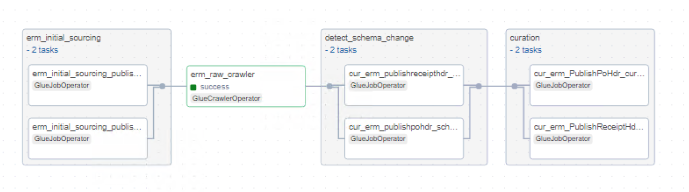

# Overview of ERM

ERM serves as a data source from which we retrieve data via an API, receiving responses in a raw format. We authenticate using a token, which we reuse until it expires, at which point we generate a new one. This automated code takes table name and query ID as arguments, runs all the necessary API calls to process the data, and stores the results in PARQUET format.

Multiple AWS Glue jobs run in parallel for different tables, storing information in S3. Logs are recorded in CloudWatch, and metadata for these jobs is stored in DynamoDB. All paths and parameters are fully parameterized. Credentials for token generation, such as client ID and secret ID, are securely stored in AWS Secrets Manager.

## Metadata files

### Raw Layer Metadata Example

```yaml
---
---
SourceSystemId: erm
MetadataType: api#erm#extract_api
api_parameter:
  api_body: 
  api_exponential_backoff: 3
  api_headers:
    Content-Type: application/json
    x-erm-env: testing
  api_method: get
  api_query_params: 
  api_request_body: 
  api_response_type: json
  api_retry: 3
  api_ssl_verify: False
  api_timeout: 300
  auth_type: Bearer
  dynamic_api_headers:
  - Authorization
  endpoint: https://api.erm.connect.aveva.com/api/erm/DataExtraction/
auth_api_parameter:
  api_name: erm
  auth_body:
    client_id: 
    client_secret: 
    grant_type: client_credentials
    scope: connect
  auth_exponential_backoff: 5
  auth_headers: 
  auth_method: post
  auth_ssl_verify: False
  auth_query_params: 
  auth_retry: 3
  auth_timeout: 1200
  dynamic_auth_headers:
  - AuthToken
  endpoint: https://signin.connect.aveva.com/oauth/token
  secret_key: Worley-datalake-sydney-dev-db-erm
aws_region: ap-southeast-2
is_active: "y"
job_parameter:
  bucket_data_source_prefix: erm
  bucket_name: worley-datalake-sydney-dev-bucket-raw-xd5ydg
  full_incremental: i
  input_path: erm
  kms_key_id: 3a4345c9-617f-4e55-8a27-70814760f56a
  output_s3: erm
  sampling_fraction: '0.5'
  sampling_seed: 42
  schema_output_s3: erm/data_sampling
  status_timeout: 1200
  temp_output_path: temp/
  status_check: 60
name: ERM_API
```

### Curation Layer Metadata Example

```yaml
---
---
SourceSystemId: erm_curated
MetadataType: curated#erm#PublishProj#job#iceberg
source:
  compute_engine: spark
  glue_options:
    connection_options: s3://worley-datalake-sydney-dev-bucket-raw-xd5ydg/erm/PublishProj/
    connection_type: s3
    format: parquet
    format_options:
      mergeSchema: true
    transformation_ctx: erm-PublishProj
  name: erm_PublishProj
  spark_options:
    format: parquet
table_schema:
  columns:
  - column_data_type: string
    column_name: tablename
    comment: tablename
    data_classification: 
    nullable: true
    raw_column_name: tablename  
  - column_data_type: string
    column_name: hull_inst_draw_no
    comment: hull_inst_draw_no
    data_classification: 
    nullable: true
    raw_column_name: hull_inst_draw_no
  - column_data_type: string
    column_name: fabricate_proj
    comment: fabricate_proj
    data_classification: 
    nullable: true
    raw_column_name: fabricate_proj
  - column_data_type: string
    column_name: proj_phase_no
    comment: proj_phase_no
    data_classification: 
    nullable: true
    raw_column_name: proj_phase_no
  - column_data_type: string
    column_name: integr_dsg_proj_id
    comment: integr_dsg_proj_id
    data_classification: 
    nullable: true
    raw_column_name: integr_dsg_proj_id
  - column_data_type: string
    column_name: fin_proj_id
    comment: fin_proj_id
    data_classification: 
    nullable: true
    raw_column_name: fin_proj_id
  - column_data_type: string
    column_name: use_proj_fin_acc_code
    comment: use_proj_fin_acc_code
    data_classification: 
    nullable: true
    raw_column_name: use_proj_fin_acc_code
  - column_data_type: string
    column_name: dflt_mto_validation
    comment: dflt_mto_validation
    data_classification: 
    nullable: true
    raw_column_name: dflt_mto_validation
  - column_data_type: string
    column_name: tax_yn
    comment: tax_yn
    data_classification: 
    nullable: true
    raw_column_name: tax_yn
  - column_data_type: string
    column_name: unit_dflt_hdr_no
    comment: unit_dflt_hdr_no
    data_classification: 
    nullable: true
    raw_column_name: unit_dflt_hdr_no
  - column_data_type: string
    column_name: default_mr_filter_json
    comment: default_mr_filter_json
    data_classification: 
    nullable: true
    raw_column_name: default_mr_filter_json
  - column_data_type: string
    column_name: tmr_no_setup_method
    comment: tmr_no_setup_method
    data_classification: 
    nullable: true
    raw_column_name: tmr_no_setup_method
  - column_data_type: string
    column_name: use_proj_cont
    comment: use_proj_cont
    data_classification: 
    nullable: true
    raw_column_name: use_proj_cont
  - column_data_type: string
    column_name: rfq_no_setup_method
    comment: rfq_no_setup_method
    data_classification: 
    nullable: true
    raw_column_name: rfq_no_setup_method
  - column_data_type: string
    column_name: create_plan_mat
    comment: create_plan_mat
    data_classification: 
    nullable: true
    raw_column_name: create_plan_mat
  - column_data_type: string
    column_name: manual_payments
    comment: manual_payments
    data_classification: 
    nullable: true
    raw_column_name: manual_payments
  - column_data_type: string
    column_name: use_dyn_mat_allocation
    comment: use_dyn_mat_allocation
    data_classification: 
    nullable: true
    raw_column_name: use_dyn_mat_allocation
  - column_data_type: string
    column_name: auto_mto_priority
    comment: auto_mto_priority
    data_classification: 
    nullable: true
    raw_column_name: auto_mto_priority
  - column_data_type: string
    column_name: use_time_phase_budg
    comment: use_time_phase_budg
    data_classification: 
    nullable: true
    raw_column_name: use_time_phase_budg
  - column_data_type: string
    column_name: budg_approved
    comment: budg_approved
    data_classification: 
    nullable: true
    raw_column_name: budg_approved
  - column_data_type: string
    column_name: fa_no_setup_method
    comment: fa_no_setup_method
    data_classification: 
    nullable: true
    raw_column_name: fa_no_setup_method
  - column_data_type: string
    column_name: is_vat_incl
    comment: is_vat_incl
    data_classification: 
    nullable: true
    raw_column_name: is_vat_incl
  - column_data_type: string
    column_name: dflt_3d_integration
    comment: dflt_3d_integration
    data_classification: 
    nullable: true
    raw_column_name: dflt_3d_integration
  - column_data_type: string
    column_name: aveva_net_imp_stag_area_no
    comment: aveva_net_imp_stag_area_no
    data_classification: 
    nullable: true
    raw_column_name: aveva_net_imp_stag_area_no
  - column_data_type: string
    column_name: std_mat_set_no
    comment: std_mat_set_no
    data_classification: 
    nullable: true
    raw_column_name: std_mat_set_no
  - column_data_type: string
    column_name: scheme_no
    comment: scheme_no
    data_classification: 
    nullable: true
    raw_column_name: scheme_no
  - column_data_type: string
    column_name: proj_trx_po
    comment: proj_trx_po
    data_classification: 
    nullable: true
    raw_column_name: proj_trx_po
  - column_data_type: string
    column_name: arf_imp_stag_area_no
    comment: arf_imp_stag_area_no
    data_classification: 
    nullable: true
    raw_column_name: arf_imp_stag_area_no
  - column_data_type: string
    column_name: allow_spec_unapprove
    comment: allow_spec_unapprove
    data_classification: 
    nullable: true
    raw_column_name: allow_spec_unapprove
  - column_data_type: string
    column_name: default_ms_filter_json
    comment: default_ms_filter_json
    data_classification: 
    nullable: true
    raw_column_name: default_ms_filter_json
  - column_data_type: string
    column_name: dflt_mr_grp_filter_json
    comment: dflt_mr_grp_filter_json
    data_classification: 
    nullable: true
    raw_column_name: dflt_mr_grp_filter_json
  - column_data_type: string
    column_name: use_weight_factors
    comment: use_weight_factors
    data_classification: 
    nullable: true
    raw_column_name: use_weight_factors
  - column_data_type: string
    column_name: proj_set_behaviour
    comment: proj_set_behaviour
    data_classification: 
    nullable: true
    raw_column_name: proj_set_behaviour
  - column_data_type: string
    column_name: auto_sync_mr_tmr
    comment: auto_sync_mr_tmr
    data_classification: 
    nullable: true
    raw_column_name: auto_sync_mr_tmr
  - column_data_type: string
    column_name: req_level
    comment: req_level
    data_classification: 
    nullable: true
    raw_column_name: req_level
  - column_data_type: string
    column_name: publishkey
    comment: publishkey
    data_classification: 
    nullable: true
    raw_column_name: publishkey
  - column_data_type: string
    column_name: primarykey
    comment: primarykey
    data_classification: 
    nullable: true
    raw_column_name: primarykey
  - column_data_type: string
    column_name: publishscn
    comment: publishscn
    data_classification: 
    nullable: true
    raw_column_name: publishscn
  - column_data_type: string
    column_name: referencetypekey
    comment: referencetypekey
    data_classification: 
    nullable: true
    raw_column_name: referencetypekey
  - column_data_type: string
    column_name: status
    comment: status
    data_classification: 
    nullable: true
    raw_column_name: status
  - column_data_type: string
    column_name: proj_no
    comment: proj_no
    data_classification: 
    nullable: false
    raw_column_name: proj_no
  - column_data_type: string
    column_name: proj_id
    comment: proj_id
    data_classification: 
    nullable: true
    raw_column_name: proj_id
  - column_data_type: string
    column_name: descr
    comment: descr
    data_classification: 
    nullable: true
    raw_column_name: descr
  - column_data_type: string
    column_name: owner
    comment: owner
    data_classification: 
    nullable: true
    raw_column_name: owner
  - column_data_type: string
    column_name: stat
    comment: stat
    data_classification: 
    nullable: true
    raw_column_name: stat
  - column_data_type: string
    column_name: sys_no_used
    comment: sys_no_used
    data_classification: 
    nullable: true
    raw_column_name: sys_no_used
  - column_data_type: string
    column_name: sister_proj_no
    comment: sister_proj_no
    data_classification: 
    nullable: true
    raw_column_name: sister_proj_no
  - column_data_type: string
    column_name: cost_acc_used
    comment: cost_acc_used
    data_classification: 
    nullable: true
    raw_column_name: cost_acc_used
  - column_data_type: string
    column_name: mars_plan_used
    comment: mars_plan_used
    data_classification: 
    nullable: true
    raw_column_name: mars_plan_used
  - column_data_type: string
    column_name: clean_pl_item
    comment: clean_pl_item
    data_classification: 
    nullable: true
    raw_column_name: clean_pl_item
  - column_data_type: string
    column_name: gen_budg
    comment: gen_budg
    data_classification: 
    nullable: true
    raw_column_name: gen_budg
  - column_data_type: string
    column_name: clean_pl_item_date
    comment: clean_pl_item_date
    data_classification: 
    nullable: true
    raw_column_name: clean_pl_item_date
  - column_data_type: string
    column_name: gen_steel_mat_stat
    comment: gen_steel_mat_stat
    data_classification: 
    nullable: true
    raw_column_name: gen_steel_mat_stat
  - column_data_type: string
    column_name: sys_part_of_proj_comp_id
    comment: sys_part_of_proj_comp_id
    data_classification: 
    nullable: true
    raw_column_name: sys_part_of_proj_comp_id
  - column_data_type: string
    column_name: inv_allowed
    comment: inv_allowed
    data_classification: 
    nullable: true
    raw_column_name: inv_allowed
  - column_data_type: string
    column_name: report_hour_allowed
    comment: report_hour_allowed
    data_classification: 
    nullable: true
    raw_column_name: report_hour_allowed
  - column_data_type: string
    column_name: template_proj
    comment: template_proj
    data_classification: 
    nullable: true
    raw_column_name: template_proj
  - column_data_type: string
    column_name: stress_curve_no
    comment: stress_curve_no
    data_classification: 
    nullable: true
    raw_column_name: stress_curve_no
  - column_data_type: string
    column_name: proj_manager_usr_id
    comment: proj_manager_usr_id
    data_classification: 
    nullable: true
    raw_column_name: proj_manager_usr_id
  - column_data_type: string
    column_name: contract_id
    comment: contract_id
    data_classification: 
    nullable: true
    raw_column_name: contract_id
  - column_data_type: string
    column_name: contract_date
    comment: contract_date
    data_classification: 
    nullable: true
    raw_column_name: contract_date
  - column_data_type: string
    column_name: project_type_no
    comment: project_type_no
    data_classification: 
    nullable: true
    raw_column_name: project_type_no
  - column_data_type: string
    column_name: length_overall
    comment: length_overall
    data_classification: 
    nullable: true
    raw_column_name: length_overall
  - column_data_type: string
    column_name: length_load_water_line
    comment: length_load_water_line
    data_classification: 
    nullable: true
    raw_column_name: length_load_water_line
  - column_data_type: string
    column_name: width
    comment: width
    data_classification: 
    nullable: true
    raw_column_name: width
  - column_data_type: string
    column_name: draught
    comment: draught
    data_classification: 
    nullable: true
    raw_column_name: draught
  - column_data_type: string
    column_name: displacement
    comment: displacement
    data_classification: 
    nullable: true
    raw_column_name: displacement
  - column_data_type: string
    column_name: light_ship_displacement
    comment: light_ship_displacement
    data_classification: 
    nullable: true
    raw_column_name: light_ship_displacement
  - column_data_type: string
    column_name: gross_tonnage
    comment: gross_tonnage
    data_classification: 
    nullable: true
    raw_column_name: gross_tonnage
  - column_data_type: string
    column_name: netto_tonnage
    comment: netto_tonnage
    data_classification: 
    nullable: true
    raw_column_name: netto_tonnage
  - column_data_type: string
    column_name: speed_max
    comment: speed_max
    data_classification: 
    nullable: true
    raw_column_name: speed_max
  - column_data_type: string
    column_name: speed_cruise
    comment: speed_cruise
    data_classification: 
    nullable: true
    raw_column_name: speed_cruise
  - column_data_type: string
    column_name: fuel_capacity
    comment: fuel_capacity
    data_classification: 
    nullable: true
    raw_column_name: fuel_capacity
  - column_data_type: string
    column_name: fresh_water_capacity
    comment: fresh_water_capacity
    data_classification: 
    nullable: true
    raw_column_name: fresh_water_capacity
  - column_data_type: string
    column_name: range
    comment: range
    data_classification: 
    nullable: true
    raw_column_name: range
  - column_data_type: string
    column_name: installed_power
    comment: installed_power
    data_classification: 
    nullable: true
    raw_column_name: installed_power
  - column_data_type: string
    column_name: installed_generating_capacity
    comment: installed_generating_capacity
    data_classification: 
    nullable: true
    raw_column_name: installed_generating_capacity
  - column_data_type: string
    column_name: steel_wgt
    comment: steel_wgt
    data_classification: 
    nullable: true
    raw_column_name: steel_wgt
  - column_data_type: string
    column_name: imo_no
    comment: imo_no
    data_classification: 
    nullable: true
    raw_column_name: imo_no
  - column_data_type: string
    column_name: classification
    comment: classification
    data_classification: 
    nullable: true
    raw_column_name: classification
  - column_data_type: string
    column_name: country_id
    comment: country_id
    data_classification: 
    nullable: true
    raw_column_name: country_id
  - column_data_type: string
    column_name: crew
    comment: crew
    data_classification: 
    nullable: true
    raw_column_name: crew
  - column_data_type: string
    column_name: sister_norm_hour_idx
    comment: sister_norm_hour_idx
    data_classification: 
    nullable: true
    raw_column_name: sister_norm_hour_idx
  - column_data_type: string
    column_name: legal_entity_no
    comment: legal_entity_no
    data_classification: 
    nullable: true
    raw_column_name: legal_entity_no
  - column_data_type: string
    column_name: start_date
    comment: start_date
    data_classification: 
    nullable: true
    raw_column_name: start_date
  - column_data_type: string
    column_name: finish_date
    comment: finish_date
    data_classification: 
    nullable: true
    raw_column_name: finish_date
  - column_data_type: string
    column_name: has_fixed_finish
    comment: has_fixed_finish
    data_classification: 
    nullable: true
    raw_column_name: has_fixed_finish
  - column_data_type: string
    column_name: default_calendar_no
    comment: default_calendar_no
    data_classification: 
    nullable: true
    raw_column_name: default_calendar_no
  - column_data_type: string
    column_name: default_delivery_site_no
    comment: default_delivery_site_no
    data_classification: 
    nullable: true
    raw_column_name: default_delivery_site_no
  - column_data_type: string
    column_name: design_proj_id
    comment: design_proj_id
    data_classification: 
    nullable: true
    raw_column_name: design_proj_id
  - column_data_type: string
    column_name: proj_site
    comment: proj_site
    data_classification: 
    nullable: true
    raw_column_name: proj_site
  - column_data_type: string
    column_name: use_expedite
    comment: use_expedite
    data_classification: 
    nullable: true
    raw_column_name: use_expedite
  - column_data_type: string
    column_name: deliv_desig_no
    comment: deliv_desig_no
    data_classification: 
    nullable: true
    raw_column_name: deliv_desig_no
  - column_data_type: string
    column_name: receive_batch_fab_only
    comment: receive_batch_fab_only
    data_classification: 
    nullable: true
    raw_column_name: receive_batch_fab_only
  - column_data_type: string
    column_name: allow_activity_on_fab_pl
    comment: allow_activity_on_fab_pl
    data_classification: 
    nullable: true
    raw_column_name: allow_activity_on_fab_pl
  - column_data_type: string
    column_name: dflt_allow_activity_on_fab_pl
    comment: dflt_allow_activity_on_fab_pl
    data_classification: 
    nullable: true
    raw_column_name: dflt_allow_activity_on_fab_pl
  - column_data_type: string
    column_name: customer_col_0
    comment: customer_col_0
    data_classification: 
    nullable: true
    raw_column_name: customer_col_0
  - column_data_type: string
    column_name: customer_col_1
    comment: customer_col_1
    data_classification: 
    nullable: true
    raw_column_name: customer_col_1
  - column_data_type: string
    column_name: customer_col_2
    comment: customer_col_2
    data_classification: 
    nullable: true
    raw_column_name: customer_col_2
  - column_data_type: string
    column_name: customer_col_3
    comment: customer_col_3
    data_classification: 
    nullable: true
    raw_column_name: customer_col_3
  - column_data_type: string
    column_name: customer_col_4
    comment: customer_col_4
    data_classification: 
    nullable: true
    raw_column_name: customer_col_4
  schema_properties:
    enforce: true
    primary_key: [proj_no]
    rename_columns: true
target:
  compute_engine: spark
  iceberg_properties:
    database_name: worley_datalake_sydney_dev_glue_catalog_database_erm
    iceberg_configuration:
      create_table: true
      iceberg_catalog_warehouse: worley-datalake-sydney-dev-bucket-curated-xd5ydg/erm/PublishProj/
      table_properties:
        format-version: '2'
        write.format.default: parquet
    table_name: curated_publishproj
  load_type: incremental
  name: curated_erm_publishproj
  primary_key: [proj_no]
  spark_options:
    format: iceberg
    options:
      path: s3://worley-datalake-sydney-dev-bucket-curated-xd5ydg/erm/PublishProj
transforms:
- rename_column: true
  transform: rename_columns
- select_columns: true
  transform: select_columns_from_config_file
- change_types: true
  transform: change_data_types
- column_name: EXECUTION_DATE
  date_format: yyyy-MM-dd
  transform: add_run_date
- sql: SELECT *, 'erm' as SOURCE_SYSTEM_NAME FROM temp_df_static
  temp_view_name: temp_df_static
  transform: custom_sql
```

## ERM Pipeline




The erm pipeline consists of 3 important tasks:

- Triggers the raw layer Glue job to process API data.
- Triggers the schema change detection Glue job to compare schema between current and previous versions.
- Triggers the curation layer Glue job that creates iceberg tables.


## Process to onboard new tables to ERM

- Run the Glue job by passing the table name and Query ID to it.
- Add a new metadata file in curation layer defining raw layer to curation layer column mappings.
- Add the table name and queryId to the Airflow DAG `erm_pipeline.py`.
