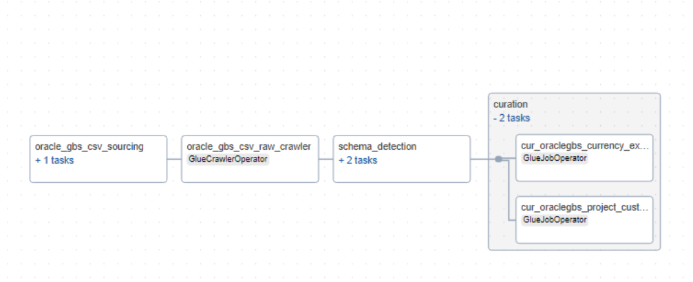

# Overview of oraclegbs

Oraclegbs is a datasource that is SFTP server based. The datasource consists of CSV files. The schema (headers of CSV files) of the files can be different from each other.

Currently, the CSV files are uploaded manually to a S3 bucket and these files are consumed by raw layer and curation layer Glue jobs. However, future scope may involve logic (possibly using AppFlow connector and Airflow Dag combination) that fetches the CSV files from SFTP and places them on S3.

The CSV files are processed sequentially within the raw layer Glue job and diagnostic information such as missing rows or empty CSV files are logged using CloudWatch logs. The CSV files are processed by a generic raw layer Glue job that uses metadata configuration to get contextual information of the CSV files. The generic Glue job is designed to handle any other datasources that generate CSV files similar to Oraclegbs. The curation layer Glue job is also generic in nature and handles the transformations using the metadata configuration of the curation layer.

## Metadata files

The table below explains the purpose of some the important parameters.

| **Filename**                                  | **Description**                                                                                                                                                      |
|:----------------------------------------------|:--------------------------------------------------------------------------------------------------------------------------------------------------------------------|
| `sampling_fraction and sampling_seed`          | These parameters are used to collect a sample set of data which is further used to detect schema changes.                                                          |
| `replace_non_alphanumeric_with_underscore`     | If the raw layer columns contain non alphanumeric characters they will be replaced by an underscore `_`.                                                        |
| `is_fixed_file_name, file_prefix_length, file_suffix_length` | In some cases the file name may end with varying date and time stamps. In order to generically identify and parse files these parameters are used.        |
| `separator`                                   | The CSV files can have various separators such as comma-separated, tab-separated, or pipe-separated.                                                               |


Below is a sample raw layer metadata file.

### Raw Layer Metadata Example

```yaml
---
---
SourceSystemId: oraclegbs
MetadataType: csv#oraclegbs
aws_region: ap-southeast-2
Env: dev
is_active: 'y'
job_parameter:
  bucket_name: <raw-layer-bucket-name>
  csv_files_path: oracle_gbs/csv/
  drop_duplicate_columns: true
  drop_duplicate_rows: true
  parquet_files_path: oracle_gbs/parquet/
  raw_files_path: oracle_gbs/raw/
  replacement_char: _
  replace_non_alphanumeric_with_underscore: true
  replace_non_printable_ascii_with_underscore: false
  sample_data_location: oracle_gbs/data_sampling
  sampling_fraction: '0.5'
  sampling_seed: 42
  specialchars_to_be_replaced_in_columnnames: []
  csv_files:
    - filename: EVA_Currency_Exchange_Rate_20240610_0229.CSV
      is_fixed_file_name: true
      file_prefix_length: 0
      file_suffix_length: 0
      multiline: true
      quote_character: '"'
      separator: ','
      tablename: currency_exchange_rate
      with_header: true
    - filename: Project_Customer_List_20210425090217.csv
      is_fixed_file_name: true
      file_prefix_length: 0
      file_suffix_length: 0
      multiline: true
      quote_character: '"'
      separator: '|'
      tablename: project_customers
      with_header: true
name: oracle_gbs
Namespace: global


```

### Curation Layer Metadata Example

```yaml
---
SourceSystemId: oraclegbs_curated
MetadataType: curated#oraclegbs#currency_exchange_rate#job#iceberg
source:
  compute_engine: spark
  glue_options:
    connection_options: s3://<raw-layer-bucket-name>/oracle_gbs/parquet/currency_exchange_rate.parquet/
    connection_type: s3
    format: parquet
    format_options:
      mergeSchema: true
    transformation_ctx: currency_exchange_rate
  name: currency_exchange_rate
  spark_options:
    format: parquet
target:
  compute_engine: spark
  iceberg_properties:
    database_name: worley_datalake_sydney_dev_glue_catalog_database_oraclegbs
    iceberg_configuration:
      create_table: true
      iceberg_catalog_warehouse: <curated-layer-bucket-name>/oracle_gbs/currency_exchange_rate/
      table_properties:
        format-version: '2'
        write.format.default: parquet
    table_name: curated_currency_exchange_rate
  load_type: incremental
  name: curated_currency_exchange_rate
  primary_key: br_key
  spark_options:
    format: iceberg
    options:
      path: s3://<curated-layer-bucket-name>/oracle_gbs/currency_exchange_rate
transforms:
- rename_column: true
  transform: rename_columns
- select_columns: true
  transform: select_columns_from_config_file
- change_types: true
  transform: change_data_types
- column_name: EXECUTION_DATE
  date_format: yyyy-MM-dd
  transform: add_run_date
- sql: SELECT datasource_num_id, br_key, gbs_key, from_currency, to_currency, conversion_type, conversion_rate, 'oracle_gbs' as SOURCE_SYSTEM_NAME, date_format(to_date(month_start_date, 'dd/MM/yyyy'), 'yyyy/MM/dd') AS month_start_date, date_format(to_date(month_end_date, 'dd/MM/yyyy'), 'yyyy/MM/dd') AS month_end_date FROM temp_df_static
  temp_view_name: temp_df_static
  transform: custom_sql
table_schema:
  schema_properties:
    enforce: true
    primary_key: br_key
    rename_columns: true
  columns:
  - column_name: datasource_num_id
    column_data_type: decimal(38,0)
    comment: datasource_num_id
    data_classification:
    nullable: true
    raw_column_name: datasource_num_id  
  - column_name: br_key
    column_data_type: decimal(38,0)
    comment: br_key
    data_classification:
    nullable: true
    raw_column_name: br_key
  - column_name: gbs_key
    column_data_type: string
    comment: gbs_key
    data_classification:
    nullable: true
    raw_column_name: gbs_key
  - column_name: from_currency
    column_data_type: string
    comment: from_currency
    data_classification:
    nullable: true
    raw_column_name: from_currency
  - column_name: to_currency
    column_data_type: string
    comment: to_currency
    data_classification:
    nullable: true
    raw_column_name: to_currency
  - column_name: conversion_type
    column_data_type: string
    comment: conversion_type
    data_classification:
    nullable: true
    raw_column_name: conversion_type
  - column_name: month_start_date
    column_data_type: date
    comment: month_start_date
    data_classification:
    nullable: true
    raw_column_name: month_start_date
  - column_name: month_end_date
    column_data_type: date
    comment: month_end_date
    data_classification:
    nullable: true
    raw_column_name: month_end_date
  - column_name: conversion_rate
    column_data_type: decimal (38,4)
    comment: conversion_rate
    data_classification:
    nullable: true
    raw_column_name: conversion_rate

```

## oraclegbs Pipeline




The oraclegbs pipeline consists of 3 important tasks:

- Triggers the raw layer Glue job to process CSV files.
- Triggers the schema change detection Glue job to compare schema between current and previous versions.
- Triggers the curation layer Glue job that creates iceberg tables.


## Key Files Handling oraclegbs Files Processing

| **Filename**                          | **Description**                                                                                                                                                                                                                      |
|:--------------------------------------|:------------------------------------------------------------------------------------------------------------------------------------------------------------------------------------------------------------------------------------|
| `oracle_gbs_csv_pipeline.py`            | The Airflow DAG pipeline for handling oraclegbs files processing.                                                                                                                                                                   |
| `convert_csv_and_xlsx_to_parquet.py`   | Generic Glue job that converts CSV and XLSX files to Parquet format. Expects the following gluejob input parameters: `--source_name:oraclegbs, --metadata_type:csv#oraclegbs, --function_name:csv, --metadata_table_name:<dynamodb_tablename>` |
| `schema_change_detection_generic.py`   | Generic Glue job that detects schema changes between current and previous versions. Expects the following gluejob input parameters: `--catalog_db:<glue_catalogue_db_for_oraclegbs>, --table_name:<raw_table_name_of_the_csv_file>`        |
| `raw_curated_generic.py`               | Generic Glue job that creates iceberg tables. Expects the following gluejob input parameters: `--source_system_id: oraclegbs_curated, --metadata_type: curated#oraclegbs#<table_name_of_the_csv_file>#job#iceberg, --metadata_table_name:<dynamodb_tablename>`. |


## Process to onboard new files to oraclegbs

- Add the metadata of the new file to raw layer metadata file.
- Add a new metadata file in curation layer defining raw layer to curation layer column mappings.
- Add the curation layer table to the Airflow DAG `oracle_gbs_csv_pipeline.py`.

## Future Scope

- Connector functionality to fetch CSV files from SFTP server and upload it to S3.
- Customizing raw layer metadata configuration to dynamically decide if Glue job processing should exit in the event of errors originating from one or more CSV files or gracefully catch the errors and continue processing rest of the files.
