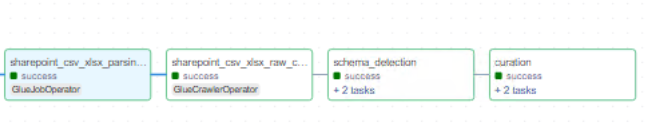

# Overview of sharepoint

Sharepoint is a datasource that hosts CSV and XLSX files on a Sharepoint platform. The datasource consists of CSV and XLSX files. Sharepoint is scoped to a project, such as "VG" or "DAC" etc. 

Currently, the CSV and XLSX files are uploaded manually to a S3 bucket and these files are consumed by raw layer and curation layer Glue jobs. However, future scope may involve logic (possibly using AppFlow connector and Airflow Dag combination) that fetches the CSV and XLSX files and places them on S3.

The CSV and XLSX files are processed sequentially within the raw layer Glue job and diagnostic information such as missing rows or empty files are logged using CloudWatch logs. The files are processed by a generic raw layer Glue job that uses metadata configuration to get contextual information of the files. The generic Glue job is designed to handle any other datasources that generate CSV or XLSX files similar to sharepoint. The curation layer Glue job is also generic in nature and handles the transformations using the metadata configuration of the curation layer.

## Metadata files

The table below explains the purpose of some the important parameters.

| **Filename**                                  | **Description**                                                                                                                                                      |
|:----------------------------------------------|:--------------------------------------------------------------------------------------------------------------------------------------------------------------------|
| `sampling_fraction and sampling_seed`          | These parameters are used to collect a sample set of data which is further used to detect schema changes.                                                          |
| `replace_non_alphanumeric_with_underscore`     | If the raw layer columns contain non alphanumeric characters they will be replaced by an underscore `_`.                                                        |
| `is_fixed_file_name, file_prefix_length, file_suffix_length` | In some cases the file name may end with varying date and time stamps. In order to generically identify and parse files these parameters are used.        |
| `separator`                                   | The CSV files or the sheets within XLSX can have various separators such as comma-separated, tab-separated, or pipe-separated.                                                               |


Below is a sample raw layer metadata file.


### Raw Layer Metadata Example

```yaml
---
SourceSystemId: sharepoint
MetadataType: csv_xlsx#vg#sharepoint
aws_region: ap-southeast-2
Env: dev
is_active: 'y'
job_parameter:
  bucket_name: <raw_layer_bucket>
  csv_files_path: vg/sharepoint/csv/
  drop_duplicate_columns: true
  drop_duplicate_rows: true
  parquet_files_path: vg/sharepoint/parquet/
  raw_files_path: vg/sharepoint/raw/
  replacement_char: _
  replace_non_alphanumeric_with_underscore: true
  replace_non_printable_ascii_with_underscore: false
  sample_data_location: vg/sharepoint/data_sampling
  sampling_fraction: '0.5'
  sampling_seed: 42
  specialchars_to_be_replaced_in_columnnames: []
  csv_files:
    - filename: Assumptions Index.csv
      is_fixed_file_name: true
      file_prefix_length: 0
      file_suffix_length: 0
      multiline: true
      quote_character: '"'
      separator: ','
      tablename: assumptions_index
      with_header: true
  xls_files:
    - filename: LFM ISO TRACKER.xlsx
      file_prefix_length: 0
      file_suffix_length: 0
      is_fixed_file_name: true
      xls_engine_name: openpyxl
      sheets:
        - sheet_name: 'ISO Tracker sheet '
          tablename: vg_sharepoint_lfm_iso_tracker_sheet
          quote_character: '"'
          separator: ','
          multiline: true
          header_row: 4
          header_column: 0
          data_start_row: 0
          data_start_column: 0
name: sharepoint
Namespace: vg

```

### Curation Layer Metadata Example

```yaml
---
SourceSystemId: sharepoint_curated
MetadataType: curated#vg_sharepoint#assumptions_index#job#iceberg
source:
  compute_engine: spark
  glue_options:
    connection_options: s3://<raw_layer_bucket>/vg/sharepoint/parquet/assumptions_index.parquet/
    connection_type: s3
    format: parquet
    transformation_ctx: vg_sharepoint-csv_xlsx_curated
  name: vg_sharepoint_csv_xlsx_curated
  spark_options:
    format: parquet
table_schema:
  columns:
  - column_data_type: string
    column_name: ASSUMPTION_ID
    comment: ASSUMPTION_ID
    data_classification: 
    nullable: true
    raw_column_name: assumption_id
  - column_data_type: string
    column_name: BASIS_FOR_ASSUMPTION
    comment: BASIS_FOR_ASSUMPTION
    data_classification: 
    nullable: true
    raw_column_name: basis_for_assumption
  - column_data_type: string
    column_name: ZONE
    comment: ZONE
    data_classification: 
    nullable: true
    raw_column_name: zone
  - column_data_type: string
    column_name: WBS_AREA
    comment: WBS_AREA
    data_classification: 
    nullable: true
    raw_column_name: wbs_area
  - column_data_type: string
    column_name: DOCUMENT_DRAWING_NO
    comment: DOCUMENT_DRAWING_NO
    data_classification: 
    nullable: true
    raw_column_name: document_drawing_no
  - column_data_type: string
    column_name: DESIGN_DELIVERABLE_DRAWING_DESCRIPTION
    comment: DESIGN_DELIVERABLE_DRAWING_DESCRIPTION
    data_classification: 
    nullable: true
    raw_column_name: design_deliverable_drawing_description
  - column_data_type: string
    column_name: DESIGN_DELIVERABLE_REV
    comment: DESIGN_DELIVERABLE_REV
    data_classification: 
    nullable: true
    raw_column_name: design_deliverable_rev
  - column_data_type: string
    column_name: KEY_DOCUMENT_TO_CLOSE_ASSUMPTION
    comment: KEY_DOCUMENT_TO_CLOSE_ASSUMPTION
    data_classification: 
    nullable: true
    raw_column_name: key_document_to_close_assumption
  - column_data_type: string
    column_name: ASSUMPTION_ADDED_BY
    comment: ASSUMPTION_ADDED_BY
    data_classification: 
    nullable: true
    raw_column_name: assumption_added_by
  - column_data_type: string
    column_name: RESPONSIBLE_ENGINEER
    comment: RESPONSIBLE_ENGINEER
    data_classification: 
    nullable: true
    raw_column_name: responsible_engineer
  - column_data_type: string
    column_name: LEAD_DISCIPLINE
    comment: LEAD_DISCIPLINE
    data_classification: 
    nullable: true
    raw_column_name: lead_discipline
  - column_data_type: timestamp
    column_name: DATE_ASSUMPTION_LISTED
    comment: DATE_ASSUMPTION_LISTED
    data_classification: 
    nullable: true
    raw_column_name: date_assumption_listed
  - column_data_type: string
    column_name: ASSUMPTION_CONFIRMED
    comment: ASSUMPTION_CONFIRMED
    data_classification: 
    nullable: true
    raw_column_name: assumption_confirmed__yes_no
  - column_data_type: timestamp
    column_name: DATE_ASSUMPTION_CONFIRMED
    comment: DATE_ASSUMPTION_CONFIRMED
    data_classification: 
    nullable: true
    raw_column_name: date_assumption_confirmed
  - column_data_type: timestamp
    column_name: DATE_DESIGN_DELIVERABLE_UPDATED_AND_ISSUED
    comment: DATE_DESIGN_DELIVERABLE_UPDATED_AND_ISSUED
    data_classification: 
    nullable: true
    raw_column_name: date_design_deliverable_updated_and_issued_if_assumption_is_invalid
  - column_data_type: string
    column_name: UPDATE_TO_ASSUMPTION_IF_INVALID
    comment: UPDATE_TO_ASSUMPTION_IF_INVALID
    data_classification: 
    nullable: true
    raw_column_name: update_to_assumption_if_invalid
  - column_data_type: string
    column_name: STATUS
    comment: STATUS
    data_classification: 
    nullable: true
    raw_column_name: status_open_closed
  - column_data_type: string
    column_name: REMARKS
    comment: REMARKS
    data_classification: 
    nullable: true
    raw_column_name: remarks
  schema_properties:
    enforce: true
    rename_columns: true
target:
  compute_engine: spark
  iceberg_properties:
    database_name: worley_datalake_sydney_dev_glue_catalog_database_vg_sharepoint
    iceberg_configuration:
      create_table: true
      iceberg_catalog_warehouse: <curated_layer_bucket>/vg/sharepoint/assumptions_index/
      table_properties:
        format-version: '2'
        write.format.default: parquet
    table_name: curated_assumptions_index
  name: curated_vg_sharepoint_assumptions_index
  load_type: append
  spark_options:
    format: iceberg
    options:
      path: s3://<curated_layer_bucket>/vg/sharepoint/assumptions_index
transforms:
- rename_column: true
  transform: rename_columns
- select_columns: true
  transform: select_columns_from_config_file
- change_types: true
  transform: change_data_types
- column_name: EXECUTION_DATE
  date_format: yyyy-MM-dd
  transform: add_run_date
- sql: SELECT *, 'vg_sharepoint' as SOURCE_SYSTEM_NAME FROM temp_df_static
  temp_view_name: temp_df_static
  transform: custom_sql


```

## sharepoint Pipeline




The sharepoint pipeline consists of 3 important tasks:

- Triggers the raw layer Glue job to process CSV and XLSX files.
- Triggers the schema change detection Glue job to compare schema between current and previous versions.
- Triggers the curation layer Glue job that creates iceberg tables.


## Key Files Handling sharepoint Files Processing

| **Filename**                          | **Description**                                                                                                                                                                                                                      |
|:--------------------------------------|:------------------------------------------------------------------------------------------------------------------------------------------------------------------------------------------------------------------------------------|
| `sharepoint_csv_and_xlsx_pipeline.py`            | The Airflow DAG pipeline for handling sharepoint files processing.                                                                                                                                                                   |
| `convert_csv_and_xlsx_to_parquet.py`   | Generic Glue job that converts CSV and XLSX files to Parquet format. Expects the following gluejob input parameters: `--source_name:sharepoint, --metadata_type:csv#sharepoint, --function_name:csv, --metadata_table_name:<dynamodb_tablename>` |
| `schema_change_detection_generic.py`   | Generic Glue job that detects schema changes between current and previous versions. Expects the following gluejob input parameters: `--catalog_db:<glue_catalogue_db_for_sharepoint>, --table_name:<raw_table_name_of_the_csv_file>`        |
| `raw_curated_generic.py`               | Generic Glue job that creates iceberg tables. Expects the following gluejob input parameters: `--source_system_id: sharepoint_curated, --metadata_type: curated#sharepoint#<table_name_of_the_csv_file>#job#iceberg, --metadata_table_name:<dynamodb_tablename>`. |


## Process to onboard new files to sharepoint

- Add the metadata of the new file to raw layer metadata file.
- Add a new metadata file in curation layer defining raw layer to curation layer column mappings.
- Add the curation layer table to the Airflow DAG `sharepoint_csv_and_xlsx_pipeline.py`.

## Future Scope

- Connector functionality to fetch CSV and XLSX files from Sharepoint and upload it to S3.
- Customizing raw layer metadata configuration to dynamically decide if Glue job processing should exit in the event of errors originating from one or more CSV or XLSX files or gracefully catch the errors and continue processing rest of the files.
