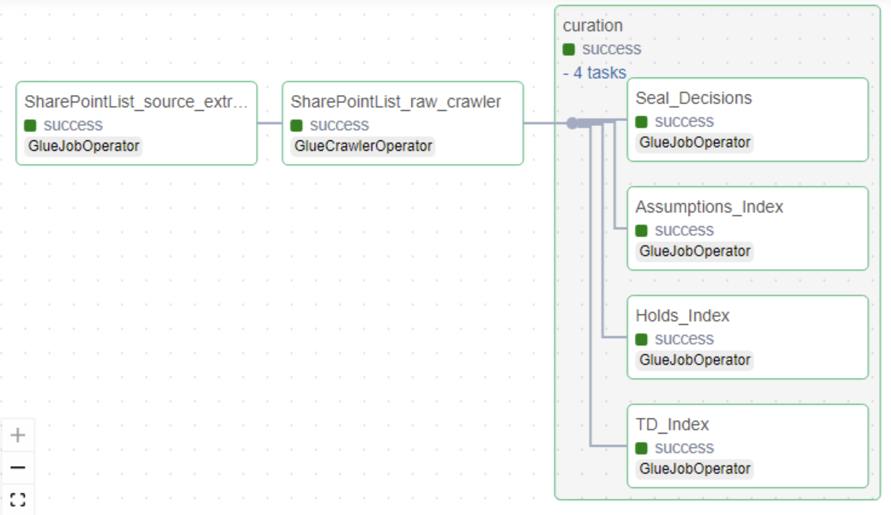

# Overview of SharePointList

SharePointList serves as a data source which consist 4 URL Assumptions Index, Holds Index, Seal Decisions, and TD Index, from which we retrieve data via an API, receiving responses in a json format. We authenticate using a Bearer Token, where we take clientid/clientsecret from Secret Manager. This automated code takes required argument, runs all the necessary API calls to process the data, and stores the results in PARQUET format.

Multiple AWS Glue jobs run in parallel for different tables, storing information in S3. Logs are recorded in CloudWatch, and metadata for these jobs is stored in DynamoDB. All paths and parameters are fully parameterized. Credentials for token generation, such as clientID and clientsecret, are securely stored in AWS Secrets Manager.

## Metadata files

### Raw Layer Metadata Example

```yaml
---
---
SourceSystemId: SharePointList
MetadataType: api#SharePointList#extract_api
api_parameter:
  api_exponential_backoff: 3
  api_headers:
    Accept: application/json;odata=verbose
  api_method: get
  api_query_params: 
  api_request_body: 
  api_response_type: json
  api_retry: 3
  api_ssl_verify: false
  api_timeout: 300
  auth_type: Bearer
  dynamic_api_headers:
  - Authorization
  endpoint: https://worleyparsons.sharepoint.com/sites/CP2VG/_api/web/lists/
  titles:
  - Assumptions Index
  - Holds Index
  - Seal Decisions
  - TD Index
auth_api_parameter:
  api_name: SharePoint
  auth_body:
    client_id: 
    client_secret: 
    grant_type: client_credentials
    resource: 00000003-0000-0ff1-ce00-000000000000/worleyparsons.sharepoint.com@73ad6539-b4fe-429c-97b6-fbc1b6ada80b
  auth_exponential_backoff: 5
  auth_headers: 
  auth_method: post
  auth_query_params: 
  auth_retry: 3
  auth_ssl_verify: false
  auth_timeout: 300
  auth_type: Bearer
  dynamic_auth_headers:
  - AuthToken
  endpoint: https://accounts.accesscontrol.windows.net/73ad6539-b4fe-429c-97b6-fbc1b6ada80b/tokens/OAuth/2
  secret_key: sharepoint_secrets
aws_region: ap-southeast-2
is_active: "y"
job_parameter:
  bucket_data_source_prefix: SharePointList
  bucket_name: worley-datalake-sydney-dev-bucket-raw-xd5ydg
  full_incremental: f
  kms_key_id: 3a4345c9-617f-4e55-8a27-70814760f56a
  output_s3: SharePointList
  sampling_fraction: '0.5'
  sampling_seed: 42
  schema_output_s3: SharePointList/data_sampling
  status_check: 600
  status_timeout: 7200
  temp_path: temp/SharePointList
name: SharePointList_API
---
```

### Curation Layer Metadata Example

```yaml
---
---
SourceSystemId: SharePointList_curated
MetadataType: curated#SharePointList#Assumptions_Index#job#iceberg
source:
  compute_engine: spark
  glue_options:
    connection_options: s3://worley-datalake-sydney-dev-bucket-raw-xd5ydg/SharePointList/Assumptions_Index/
    connection_type: s3
    format: parquet
    format_options:
      mergeSchema: true
    transformation_ctx: SharePointList-Assumptions_Index
  name: SharePointList_Assumptions_Index
  spark_options:
    format: parquet
table_schema:
  columns:
  - column_data_type: string
    column_name: metadata_id
    comment: metadata_id
    data_classification: 
    nullable: true
    raw_column_name: metadata_id
  - column_data_type: string
    column_name: metadata_uri
    comment: metadata_uri
    data_classification: 
    nullable: true
    raw_column_name: metadata_uri
  - column_data_type: string
    column_name: metadata_etag
    comment: metadata_etag
    data_classification: 
    nullable: true
    raw_column_name: metadata_etag
  - column_data_type: string
    column_name: metadata_type
    comment: metadata_type
    data_classification: 
    nullable: true
    raw_column_name: metadata_type
  - column_data_type: string
    column_name: firstuniqueancestorsecurableobject_deferred_uri
    comment: firstuniqueancestorsecurableobject_deferred_uri
    data_classification: 
    nullable: true
    raw_column_name: firstuniqueancestorsecurableobject_deferred_uri
  - column_data_type: string
    column_name: roleassignments_deferred_uri
    comment: roleassignments_deferred_uri
    data_classification: 
    nullable: true
    raw_column_name: documeroleassignments_deferred_urintnumber
  - column_data_type: string
    column_name: attachmentfiles_deferred_uri
    comment: attachmentfiles_deferred_uri
    data_classification: 
    nullable: true
    raw_column_name: attachmentfiles_deferred_uri
  - column_data_type: string
    column_name: contenttype_deferred_uri
    comment: contenttype_deferred_uri
    data_classification: 
    nullable: true
    raw_column_name: contenttype_deferred_uri
  - column_data_type: string
    column_name: getdlppolicytip_deferred_uri
    comment: getdlppolicytip_deferred_uri
    data_classification: 
    nullable: true
    raw_column_name: getdlppolicytip_deferred_uri
  - column_data_type: string
    column_name: fieldvaluesashtml_deferred_uri
    comment: fieldvaluesashtml_deferred_uri
    data_classification: 
    nullable: true
    raw_column_name: fieldvaluesashtml_deferred_uri
  - column_data_type: string
    column_name: fieldvaluesastext_deferred_uri
    comment: fieldvaluesastext_deferred_uri
    data_classification: 
    nullable: true
    raw_column_name: fieldvaluesastext_deferred_uri
  - column_data_type: string
    column_name: fieldvaluesforedit_deferred_uri
    comment: fieldvaluesforedit_deferred_uri
    data_classification: 
    nullable: true
    raw_column_name: fieldvaluesforedit_deferred_uri
  - column_data_type: string
    column_name: file_deferred_uri
    comment: file_deferred_uri
    data_classification: 
    nullable: true
    raw_column_name: file_deferred_uri
  - column_data_type: string
    column_name: folder_deferred_uri
    comment: folder_deferred_uri
    data_classification: 
    nullable: true
    raw_column_name: folder_deferred_uri
  - column_data_type: string
    column_name: likedbyinformation_deferred_uri
    comment: likedbyinformation_deferred_uri
    data_classification: 
    nullable: true
    raw_column_name: likedbyinformation_deferred_uri
  - column_data_type: string
    column_name: parentlist_deferred_uri
    comment: parentlist_deferred_uri
    data_classification: 
    nullable: true
    raw_column_name: parentlist_deferred_uri
  - column_data_type: string
    column_name: properties_deferred_uri
    comment: properties_deferred_uri
    data_classification: 
    nullable: true
    raw_column_name: properties_deferred_uri
  - column_data_type: string
    column_name: versions_deferred_uri
    comment: versions_deferred_uri
    data_classification: 
    nullable: true
    raw_column_name: versions_deferred_uri
  - column_data_type: string
    column_name: filesystemobjecttype
    comment: filesystemobjecttype
    data_classification: 
    nullable: true
    raw_column_name: filesystemobjecttype
  - column_data_type: string
    column_name: id
    comment: id
    data_classification: 
    nullable: true
    raw_column_name: id
  - column_data_type: string
    column_name: serverredirectedembeduri
    comment: serverredirectedembeduri
    data_classification: 
    nullable: true
    raw_column_name: serverredirectedembeduri
  - column_data_type: string
    column_name: serverredirectedembedurl
    comment: serverredirectedembedurl
    data_classification: 
    nullable: true
    raw_column_name: serverredirectedembedurl
  - column_data_type: string
    column_name: contenttypeid
    comment: contenttypeid
    data_classification: 
    nullable: true
    raw_column_name: contenttypeid
  - column_data_type: string
    column_name: title
    comment: title
    data_classification: 
    nullable: true
    raw_column_name: title
  - column_data_type: string
    column_name: odatacolortag
    comment: odatacolortag
    data_classification: 
    nullable: true
    raw_column_name: odatacolortag
  - column_data_type: string
    column_name: complianceassetid
    comment: complianceassetid
    data_classification: 
    nullable: true
    raw_column_name: complianceassetid
  - column_data_type: string
    column_name: designdeliverable_drawingno
    comment: field_1
    data_classification: 
    nullable: true
    raw_column_name: field_1
  - column_data_type: string
    column_name: designdeliverable_drawingdescription
    comment: field_2
    data_classification: 
    nullable: true
    raw_column_name: field_2
  - column_data_type: string
    column_name: basis_for_assumption
    comment: field_3
    data_classification: 
    nullable: true
    raw_column_name: field_3
  - column_data_type: string
    column_name: assumption_added_by
    comment: field_4
    data_classification: 
    nullable: true
    raw_column_name: field_4
  - column_data_type: string
    column_name: responsible_engineer
    comment: field_5
    data_classification: 
    nullable: true
    raw_column_name: field_5
  - column_data_type: string
    column_name: lead_discipline
    comment: field_6
    data_classification: 
    nullable: true
    raw_column_name: field_6
  - column_data_type: string
    column_name: date_assumption_confirmed
    comment: field_7
    data_classification: 
    nullable: true
    raw_column_name: field_7
  - column_data_type: string
    column_name: date_design_deliverable_updated
    comment: field_8
    data_classification: 
    nullable: true
    raw_column_name: field_8
  - column_data_type: string
    column_name: assumption_confirmed
    comment: field_9
    data_classification: 
    nullable: true
    raw_column_name: field_9
  - column_data_type: string
    column_name: wbsarea
    comment: wbsarea
    data_classification: 
    nullable: true
    raw_column_name: wbsarea
  - column_data_type: string
    column_name: designdeliverablerev
    comment: designdeliverablerev
    data_classification: 
    nullable: true
    raw_column_name: designdeliverablerev
  - column_data_type: string
    column_name: keydocumenttocloseassumption
    comment: keydocumenttocloseassumption
    data_classification: 
    nullable: true
    raw_column_name: keydocumenttocloseassumption
  - column_data_type: string
    column_name: datedesigndeliverableupdatedandi
    comment: datedesigndeliverableupdatedandi
    data_classification: 
    nullable: true
    raw_column_name: datedesigndeliverableupdatedandi
  - column_data_type: string
    column_name: updatetoassumptionifinvalid
    comment: updatetoassumptionifinvalid
    data_classification: 
    nullable: true
    raw_column_name: updatetoassumptionifinvalid
  - column_data_type: string
    column_name: status_x0028_open_x002f_closed_x
    comment: status_x0028_open_x002f_closed_x
    data_classification: 
    nullable: true
    raw_column_name: status_x0028_open_x002f_closed_x
  - column_data_type: string
    column_name: remarks
    comment: remarks
    data_classification: 
    nullable: true
    raw_column_name: remarks
  - column_data_type: string
    column_name: modified
    comment: modified
    data_classification: 
    nullable: true
    raw_column_name: modified
  - column_data_type: string
    column_name: created
    comment: created
    data_classification: 
    nullable: true
    raw_column_name: created
  - column_data_type: string
    column_name: authorid
    comment: authorid
    data_classification: 
    nullable: true
    raw_column_name: authorid
  - column_data_type: string
    column_name: editorid
    comment: editorid
    data_classification: 
    nullable: true
    raw_column_name: editorid
  - column_data_type: string
    column_name: odatauiversionstring
    comment: odatauiversionstring
    data_classification: 
    nullable: true
    raw_column_name: odatauiversionstring
  - column_data_type: string
    column_name: attachments
    comment: attachments
    data_classification: 
    nullable: true
    raw_column_name: attachments
  - column_data_type: string
    column_name: guid
    comment: guid
    data_classification: 
    nullable: true
    raw_column_name: guid
  schema_properties:
    enforce: true
    rename_columns: true
target:
  compute_engine: spark
  iceberg_properties:
    database_name: worley_datalake_sydney_dev_glue_catalog_database_sharepointlist
    iceberg_configuration:
      create_table: true
      iceberg_catalog_warehouse: worley-datalake-sydney-dev-bucket-curated-xd5ydg/SharePointList/Assumptions_Index/
      table_properties:
        format-version: '2'
        write.format.default: parquet
    table_name: curated_sharepointlist_assumptions_index
  load_type: incremental
  name: curated_sharepointlist_assumptions_index
  spark_options:
    format: iceberg
    options:
      path: s3://worley-datalake-sydney-dev-bucket-curated-xd5ydg/SharePointList/Assumptions_Index
transforms:
- rename_column: true
  transform: rename_columns
- select_columns: true
  transform: select_columns_from_config_file
- change_types: true
  transform: change_data_types
- column_name: EXECUTION_DATE
  date_format: yyyy-MM-dd
  transform: add_run_date
- sql: SELECT *, 'SharePointList' as SOURCE_SYSTEM_NAME FROM temp_df_static
  temp_view_name: temp_df_static
  transform: custom_sql

```

## SharePointList Pipeline




The SharePointList pipeline consists of 3 important tasks:

- Triggers the raw layer Glue job to process API data.
- Triggers the schema change detection Glue job to compare schema between current and previous versions.
- Triggers the curation layer Glue job that creates iceberg tables.


## Process to onboard new tables to SharePointList

- Create metadata for that table. Run the Glue job.
- Add a new metadata file in curation layer defining raw layer to curation layer column mappings.
- Add the table name to the Airflow DAG `sharepointlist_pipeline.py`.